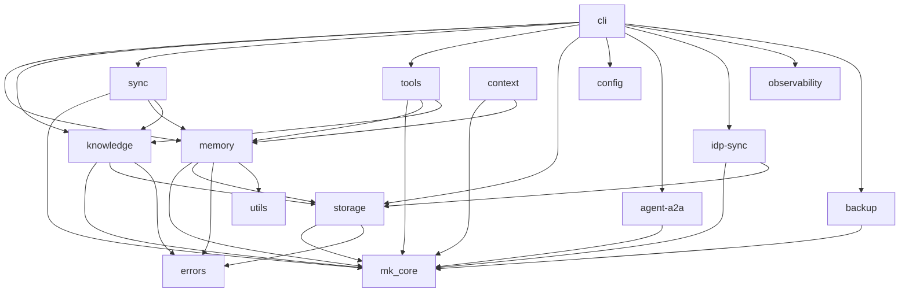

# Aeterna Architecture

Universal Memory & Knowledge Framework for Enterprise AI Agent Systems.

Aeterna provides hierarchical memory storage, governed organizational knowledge, and a pluggable adapter architecture for AI agents at scale. It is multi-tenant, multi-backend, and designed for production enterprise deployments.

---

## System Overview

```
+---------------------------------------------------+
|                CLI / Server                         |
|  (Axum HTTP + WebSocket + MCP + A2A)               |
+---------+---------+-----------+--------------------+
| Admin UI| Auth    | Backup /  | IDP Sync           |
| (React) | (JWT)   | Restore   | (Okta)             |
+---------+---------+-----------+--------------------+
|             API Layer (70+ endpoints)               |
+---------+---------+-----------+--------------------+
| Memory  |Knowledge| Governance| Tenant Config       |
| Manager | Manager | Engine    | Provider            |
+---------+---------+-----------+--------------------+
|          Provider Registry (per-tenant)              |
|       (LLM + Embedding with DashMap cache)          |
+---------+---------+-----------+--------------------+
|PostgreSQL| Qdrant  |  DuckDB  |     Redis           |
|          | (vector)|  (graph) |   (session)         |
+----------+---------+----------+---------------------+
```

### Storage Backends

| Backend | Purpose | Crate |
|---|---|---|
| PostgreSQL 16+ | Relational data, memories (episodic/procedural/user/org) metadata, governance, tenant config, RLS-based isolation. Semantic vectors live in Qdrant. **ReplicaSet**: shared across all replicas via connection pool. | `storage` |
| Qdrant 1.12+ | Vector search for semantic and archival memory layers. **ReplicaSet**: shared across all replicas. | `storage` |
| DuckDB 0.9+ | In-process graph layer for memory relationships. **ReplicaSet**: each replica has its own instance, rebuilt from PostgreSQL on startup. | `storage` |
| Redis 7+ | Working/session memory, job state, refresh tokens, distributed locks. **ReplicaSet**: shared across all replicas; the coordination backbone for multi-instance deployment. | `storage` |

---

## Deployment Model: Kubernetes ReplicaSet

Aeterna ALWAYS runs as a Kubernetes ReplicaSet with multiple replicas behind a load balancer. Every component must be stateless or use shared external state. This is a non-negotiable architectural constraint.

### Rules

1. **No in-process state that survives requests** -- All mutable state must live in PostgreSQL, Redis, or Qdrant. In-memory caches (DashMap) are acceptable only as read-through caches with TTL, where stale data is tolerable for the cache duration.

2. **No in-memory job stores** -- Background job state (export/import jobs, remediation requests, dead-letter items) must be stored in Redis or PostgreSQL so any replica can read/write them.

3. **No in-memory token stores** -- Authentication tokens (refresh tokens, session state) must be stored in Redis with TTL so token rotation works across replicas.

4. **Distributed locks for singleton tasks** -- Lifecycle tasks (reconciliation, retention, decay, cleanup) must acquire a Redis distributed lock before executing. Only one replica runs each task per cycle.

5. **Cache invalidation is per-instance** -- DashMap caches (provider registry, quota enforcer) are per-replica. Invalidation calls only affect the local instance. TTL-based expiry ensures eventual consistency across replicas.

6. **No local filesystem for shared data** -- Export archives must be uploaded to S3/object storage. Local temp files are for in-flight processing only and must be cleaned up.

### What lives where

| Store | Backend | Why |
|-------|---------|-----|
| Memory entries, knowledge items, org units, policies | PostgreSQL | Durable, queryable, RLS |
| Vector embeddings | Qdrant | Vector search |
| Graph nodes/edges | DuckDB | In-process, rebuilt from PG on startup |
| Session/working memory | Redis | Fast, TTL-based expiry |
| Export/import job state | Redis | Shared across replicas, TTL cleanup |
| Remediation requests | Redis | Shared across replicas |
| Dead-letter queue | Redis | Shared across replicas |
| Refresh tokens | Redis | Single-use rotation across replicas |
| Provider registry cache | DashMap (per-instance) | Read-through, 1h TTL |
| Quota usage cache | DashMap (per-instance) | Read-through, 5min TTL |
| Lifecycle task locks | Redis | Distributed lock, one replica per task |

---

## Workspace Crate Map

```
aeterna/
  mk_core/          Shared types, traits, domain primitives
  memory/            Memory system (7 layers, provider registry, reasoning)
  knowledge/         Knowledge repository (Git-backed, constraint DSL, governance)
  sync/              Memory <-> Knowledge sync bridge + WebSocket server
  tools/             MCP tool interface (11 tools)
  adapters/          Ecosystem adapters (OpenCode, LangChain, Radkit)
  storage/           Storage layer (Postgres, Qdrant, Redis, DuckDB)
  config/            Configuration management, hot-reload
  errors/            Error handling framework
  utils/             Common utilities
  context/           Context compression (CCA)
  cli/               CLI binary + Axum HTTP server
  agent-a2a/         Agent-to-Agent protocol (Radkit SDK)
  opal-fetcher/      OPAL policy sync
  observability/     OpenTelemetry + Prometheus metrics
  testing/           Shared test fixtures and helpers
  idp-sync/          Identity provider sync (Okta webhooks)
  cross-tests/       Integration tests (require Docker)
  backup/            Backup/restore system (archive, NDJSON, S3)
  admin-ui/          Admin web UI (React, not a Cargo crate)
  openspec/          Change proposals and versioned specs
```

### Crate Dependency Graph



---

## Multi-Tenancy Model

Every operation is scoped by a hierarchical context:

```
tenant -> org -> team -> project -> user -> agent
```

### Tenant Isolation

- **Row-Level Security (RLS)**: PostgreSQL `SET app.tenant_id` on every connection ensures data isolation at the database level.
- **`__root__` sentinel**: The special tenant ID `__root__` is used for PlatformAdmin operations that span all tenants.
- **Tenant context resolution**: The `TenantContext` struct (in `mk_core/src/types.rs`) carries `tenant_id`, `user_id`, `agent_id`, `roles`, and optional `target_tenant_id` for cross-tenant admin operations.
- **Header-based extraction**: API requests provide `X-Tenant-ID`, `X-User-ID`, `X-User-Role`, and optionally `X-Target-Tenant-ID` headers. When plugin auth is enabled, identity is extracted from the JWT instead.

### Tenant Configuration

Each tenant can override platform defaults for:
- LLM provider and model (`llm_provider`, `llm_model`, `llm_api_key`)
- Embedding provider and model (`embedding_provider`, `embedding_model`, `embedding_api_key`)
- Cloud-specific settings (Google project/location, AWS Bedrock region)
- S3 backup destination

Configuration is stored as `TenantConfigDocument` in PostgreSQL, with secrets managed separately. The `KubernetesTenantConfigProvider` resolves config at runtime.

---

## Authentication and Authorization

### Authentication Flow

1. **GitHub OAuth**: Users authenticate via GitHub OAuth (initiated by the OpenCode plugin or admin UI).
2. **JWT issuance**: The `plugin_auth` module exchanges the GitHub OAuth code for Aeterna-issued JWTs (access + refresh tokens).
3. **Token refresh**: Refresh tokens are single-use and rotated on every refresh via `RefreshTokenStore`.
4. **Admin session**: The `/api/v1/auth/admin/session` endpoint bootstraps the admin UI with user profile, tenants, and role assignments.

### Role Hierarchy

Defined in `mk_core/src/types.rs` as the `Role` enum:

```
PlatformAdmin > TenantAdmin > Admin > Architect > TechLead > Developer > Agent > Viewer
```

- **PlatformAdmin**: Cross-tenant operations, system configuration
- **TenantAdmin**: Tenant-scoped administration
- **Admin/Architect/TechLead**: Governance and knowledge management
- **Developer**: Standard memory and knowledge operations
- **Agent**: AI agent operations (scoped to agent context)
- **Viewer**: Read-only access

### Authorization Engine

- **Cedar policies** (`policies/` directory): Define fine-grained authorization rules
- **OPAL + Cedar Agent**: Runtime policy evaluation and synchronization
- **Aeterna stores**: PostgreSQL-backed membership, role assignment, and hierarchy data
- **Okta**: Identity authority; GitHub is federated through Okta for enterprise SSO

---

## Memory System

### Memory Layers (Logical)

Defined in `mk_core/src/types.rs` as the `MemoryLayer` enum:

| Layer | Precedence | Description |
|---|---|---|
| Agent | 1 (lowest) | Volatile per-agent context |
| User | 2 | Per-user preferences and history |
| Session | 3 | Session-scoped working memory |
| Project | 4 | Project-level shared knowledge |
| Team | 5 | Team-wide conventions |
| Org | 6 | Organization policies |
| Company | 7 (highest) | Company-wide standards |

### Storage Tiers (Physical)

| Tier | Backend | Latency Target |
|---|---|---|
| Working | Redis in-memory | < 10ms |
| Session | Redis with TTL | < 50ms |
| Episodic | PostgreSQL (metadata) + Qdrant (vectors) | hours |
| Semantic | Qdrant vector search | < 200ms |
| Procedural | PostgreSQL facts | weeks |
| User/Org | PostgreSQL (metadata) + Qdrant (vectors) | months |
| Archival | Qdrant long-term | years |

### Key Components

- **`MemoryManager`** (`memory/src/manager.rs`): Orchestrates memory operations across all storage tiers.
- **`TenantProviderRegistry`** (`memory/src/provider_registry.rs`): Caches per-tenant LLM and embedding service instances using `DashMap` with TTL-based expiration. Falls back to platform defaults when a tenant has no custom provider.
- **`ReflectiveReasoner`** (`memory/src/reasoning.rs`): R1-style reflective reasoning for memory optimization.
- **`DuckDbGraphStore`** (`storage/src/graph_duckdb.rs`): In-process graph layer for memory relationship queries.

---

## Knowledge System

### Repository Structure

Knowledge is stored in Git-backed repositories with a hierarchical override model:

```
Company -> Organization -> Team -> Project
```

Policies flow downward; projects can override using `Merge` or `Override` strategies.

### Key Components

- **`KnowledgeManager`** (`knowledge/src/manager.rs`): CRUD operations on knowledge entries.
- **`GovernanceEngine`** (`knowledge/src/governance.rs`): Manages approval workflows for knowledge promotion.
- **`GovernanceDashboardApi`** (`knowledge/src/api.rs`): REST API for governance operations.
- **`TenantRepositoryResolver`** (`knowledge/src/tenant_repo_resolver.rs`): Maps tenants to their knowledge repositories.

---

## Data Flow Diagrams

### Memory Add

```
Client -> API (POST /api/v1/memories)
  -> authenticated_tenant_context() [extract tenant + user from JWT/headers]
  -> MemoryManager.add()
    -> TenantProviderRegistry.get_embedding_service(tenant_id)
    -> EmbeddingService.embed(content) [tenant-specific or platform default]
    -> PostgresBackend.insert_memory()
    -> QdrantStore.upsert_vector()
    -> DuckDbGraphStore.add_node() [if graph store enabled]
  <- 201 Created
```

### Memory Search

```
Client -> API (POST /api/v1/memories/search)
  -> authenticated_tenant_context()
  -> MemoryManager.search()
    -> TenantProviderRegistry.get_embedding_service(tenant_id)
    -> EmbeddingService.embed(query)
    -> QdrantStore.search_similar(vector, tenant_filter)
    -> PostgresBackend.hydrate_memories(ids)
    -> rank and merge results
  <- 200 OK [scored results]
```

### Knowledge Promotion

```
Client -> API (POST /api/v1/governance/promote)
  -> authenticated_tenant_context() [require Admin+ role]
  -> GovernanceEngine.submit_promotion()
    -> validate knowledge entry
    -> create governance event
    -> if auto-approved: KnowledgeManager.promote()
    -> if requires review: queue for approval
    -> GovernanceStorage.record_event()
  <- 202 Accepted
```

### Backup Export

**ReplicaSet note**: Export/import job state must be stored in Redis so any replica can report status. The archive file must be uploaded to S3 -- local filesystem is only for in-flight processing.

```
Client -> API (POST /api/v1/backup/export)
  -> authenticated_tenant_context() [require TenantAdmin+ role]
  -> spawn background Tokio task
    -> ArchiveWriter.new(temp_dir)
    -> PostgresBackend.cursor_read_memories(tenant_id) -> NDJSON
    -> PostgresBackend.cursor_read_knowledge(tenant_id) -> NDJSON
    -> write manifest.json + checksums.sha256
    -> tar.gz archive
    -> if S3 destination: s3::upload(archive)
  <- 202 Accepted { job_id }

Client -> API (GET /api/v1/backup/export/{job_id})
  <- 200 OK { status, progress, download_url }
```

### Backup Import

```
Client -> API (POST /api/v1/backup/import)
  -> authenticated_tenant_context() [require TenantAdmin+ role]
  -> ArchiveReader.open(archive_path)
    -> validate manifest.json
    -> verify checksums.sha256
    -> determine import mode (merge/replace/skip)
    -> if dry_run: return validation report
    -> PostgresBackend.bulk_insert()
    -> QdrantStore.bulk_upsert()
  <- 200 OK { import_summary }
```

---

## Per-Tenant Provider Configuration

The `TenantProviderRegistry` (`memory/src/provider_registry.rs`) resolves LLM and embedding providers per tenant:

1. **Platform defaults**: Set via environment variables (`OPENAI_API_KEY`, `EMBEDDING_MODEL`, etc.)
2. **Tenant overrides**: Stored in `TenantConfigDocument` with these field names:

| Field | Purpose |
|---|---|
| `llm_provider` | Provider type: `openai`, `google`, `bedrock` |
| `llm_model` | Model identifier (e.g., `gpt-4o`) |
| `llm_api_key` | Secret logical name for API key |
| `llm_google_project_id` | Google Cloud project (Vertex AI) |
| `llm_google_location` | Google Cloud region |
| `llm_bedrock_region` | AWS region for Bedrock |
| `embedding_provider` | Provider type for embeddings |
| `embedding_model` | Embedding model identifier |
| `embedding_api_key` | Secret logical name for embedding API key |
| `embedding_google_project_id` | Google Cloud project for embeddings |
| `embedding_google_location` | Google Cloud region for embeddings |
| `embedding_bedrock_region` | AWS region for Bedrock embeddings |

3. **Cache**: `DashMap<TenantId, CachedProvider>` with configurable TTL to avoid repeated config lookups. **ReplicaSet note**: this cache is per-instance. Each replica maintains its own DashMap. Config changes propagate to all replicas within the TTL window (default 1h). There is no cross-replica cache invalidation.

---

## Backup and Restore

The `backup` crate (`backup/`) provides the core archive format:

### Archive Format

```
archive.tar.gz
  manifest.json          # Metadata: version, tenant, timestamp, entity counts, scope
  memories.ndjson        # One JSON object per line
  knowledge.ndjson
  policies.ndjson
  org_units.ndjson
  role_assignments.ndjson
  governance_events.ndjson
  checksums.sha256       # SHA-256 hash of each file
```

### Modules

| Module | File | Purpose |
|---|---|---|
| `manifest` | `backup/src/manifest.rs` | Archive metadata and entity counts |
| `ndjson` | `backup/src/ndjson.rs` | Streaming newline-delimited JSON reader/writer |
| `checksum` | `backup/src/checksum.rs` | SHA-256 computation and verification |
| `archive` | `backup/src/archive.rs` | Tar/gzip archive writer and reader |
| `validate` | `backup/src/validate.rs` | Offline archive validation |
| `s3` | `backup/src/s3.rs` | S3 upload/download |
| `destination` | `backup/src/destination.rs` | Export destination abstraction (local/S3) |
| `error` | `backup/src/error.rs` | Structured error types |

### Import Modes

- **Merge**: Insert new records, skip existing (by ID)
- **Replace**: Overwrite existing records
- **Skip**: Only import records that do not already exist
- **Dry-run**: Validate the archive without writing data

### S3 Configuration

Platform default S3 bucket from environment. Tenants can override with per-tenant S3 destination config.

---

## Server Architecture

The CLI binary (`cli/`) hosts an Axum HTTP server with the following route groups:

### Route Structure (from `cli/src/server/router.rs`)

| Path Prefix | Auth | Handler Module | Purpose |
|---|---|---|---|
| `/health`, `/live`, `/ready` | None | `health` | Health probes |
| `/api/v1/auth/plugin/*` | None | `plugin_auth` | OAuth bootstrap, token refresh, logout |
| `/api/v1/memories/*` | JWT | `memory_api` | Memory CRUD and search |
| `/api/v1/knowledge/*` | JWT | `knowledge_api` | Knowledge operations |
| `/api/v1/governance/*` | JWT | `govern_api` | Governance dashboard |
| `/api/v1/tenants/*` | JWT | `tenant_api` | Tenant management |
| `/api/v1/orgs/*` | JWT | `org_api` | Organization management |
| `/api/v1/teams/*` | JWT | `team_api` | Team management |
| `/api/v1/projects/*` | JWT | `project_api` | Project management |
| `/api/v1/users/*` | JWT | `user_api` | User management |
| `/api/v1/admin/*` | JWT | `role_grants` | Role administration |
| `/api/v1/backup/*` | JWT | `backup_api` | Export/import operations |
| `/api/v1/sync/*` | JWT | `sync` | Memory-knowledge sync |
| `/api/v1/sessions/*` | JWT | `sessions` | Session management |
| `/api/v1/webhooks/*` | JWT | `webhooks` | Webhook endpoints |
| `/mcp/*` | JWT | `mcp_transport` | MCP protocol transport |
| `/ws/*` | JWT | WebSocket server | Real-time sync |
| `/a2a/*` | A2A auth | `agent-a2a` | Agent-to-Agent protocol |
| `/webhooks/*` | IDP | `idp-sync` | Okta webhook receiver |
| `/admin/*` | Static | ServeDir | Admin UI (React SPA) |

### Application State (`AppState`)

The `AppState` struct (`cli/src/server/mod.rs`) holds all shared server state. **ReplicaSet note**: `AppState` is per-replica. Fields like `provider_registry` and `plugin_auth_state` contain in-process caches that are NOT shared across replicas. Durable shared state flows through PostgreSQL, Redis, and Qdrant connections held in AppState.

- `config` -- Server and feature configuration
- `postgres` -- PostgreSQL connection pool
- `memory_manager` -- Memory operations orchestrator
- `knowledge_manager` -- Knowledge operations
- `governance_engine` -- Approval workflows
- `auth_service` -- Cedar-based authorization
- `mcp_server` -- MCP tool server
- `sync_manager` -- Memory-Knowledge sync
- `provider_registry` -- Per-tenant LLM/embedding cache
- `tenant_store` / `tenant_config_provider` -- Tenant data and config
- `ws_server` -- WebSocket server for real-time updates
- `plugin_auth_state` -- JWT configuration and refresh token store

### Middleware Stack

Applied in order (outermost first):
1. `TraceLayer` -- OpenTelemetry-compatible request tracing
2. `CorsLayer` -- Cross-origin resource sharing
3. `CompressionLayer` -- Gzip response compression
4. `SetRequestIdLayer` / `PropagateRequestIdLayer` -- X-Request-ID propagation
5. `record_http_metrics` -- Prometheus counter/histogram for every request
6. `AuthenticationLayer` -- JWT validation (on protected routes only)

---

## Observability

### Metrics

- **Prometheus**: `metrics-exporter-prometheus` exposes `/metrics` endpoint
- **Counters**: `http_requests_total` (method, path, status)
- **Histograms**: `http_request_duration_ms` (method, path, status)
- Custom business metrics via the `observability` crate

### Logging

- **Structured logging**: `tracing` crate with `tracing-subscriber`
- **Configuration**: `RUST_LOG` environment variable (e.g., `RUST_LOG=aeterna=debug,sqlx=warn`)
- **Request correlation**: X-Request-ID propagated through all log spans

### Health Endpoints

| Endpoint | Purpose |
|---|---|
| `GET /health` | Liveness check |
| `GET /live` | Kubernetes liveness probe |
| `GET /ready` | Readiness check (includes backend connectivity) |

---

## Performance Targets

| Tier | Latency | Throughput |
|---|---|---|
| Working memory | < 10ms | -- |
| Session memory | < 50ms | -- |
| Semantic search | < 200ms | -- |
| API | -- | > 100 QPS |
| Creates | -- | > 50 CPS |
| CPU | -- | < 70% |
| Memory | -- | < 80% |
| DB connections | -- | < 80% pool |

---

## Deployment

### Docker Compose (Development)

```bash
docker-compose up -d  # PostgreSQL, Redis, Qdrant
cargo run -p aeterna-cli -- serve
```

### Helm Chart (Production)

Helm charts are in `charts/`. See `deploy/` for deployment scripts and `infrastructure/` for Terraform/IaC.

### Admin UI

The React admin UI is served as static assets from `/admin/*` when the `admin-ui/dist/` directory exists. Override with `AETERNA_ADMIN_UI_PATH` environment variable.
