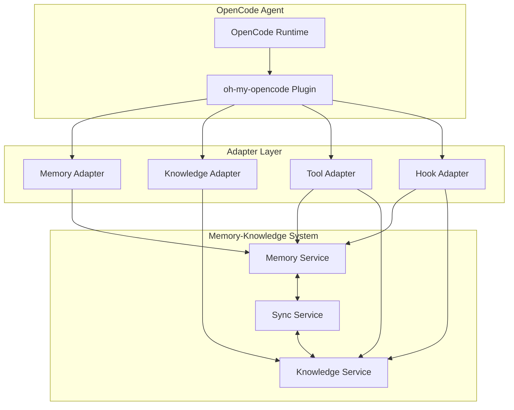

# OpenCode Ecosystem Adapter

This adapter integrates the Memory-Knowledge System with [OpenCode](https://opencode.ai) and the [oh-my-opencode](https://github.com/opencode-project/oh-my-opencode) plugin.

## Overview

The OpenCode adapter provides:

1. **Memory Provider Integration** - Connect oh-my-opencode's memory features to the standardized Memory-Knowledge System
2. **Knowledge Repository Access** - Expose knowledge items through OpenCode's tool system
3. **MCP Bridge** - Enable Memory-Knowledge operations via Model Context Protocol
4. **Hook Integration** - Automatic memory injection and knowledge monitoring

## Architecture



## Installation

### npm

```bash
npm install @memory-knowledge-spec/opencode-adapter
```

### bun

```bash
bun add @memory-knowledge-spec/opencode-adapter
```

## Configuration

### oh-my-opencode.json

Add to your `~/.config/opencode/oh-my-opencode.json`:

```json
{
  "memory": {
    "provider": "memory-knowledge-spec",
    "config": {
      "endpoint": "http://localhost:8080",
      "apiKey": "${MK_API_KEY}",
      "layers": {
        "agent": true,
        "user": true,
        "session": true,
        "project": true
      }
    }
  },
  "knowledge": {
    "enabled": true,
    "endpoint": "http://localhost:8080/knowledge",
    "syncInterval": 60000
  }
}
```

### Environment Variables

```bash
# API configuration
MK_ENDPOINT=http://localhost:8080
MK_API_KEY=your-api-key

# Memory settings
MK_MEMORY_LAYERS=agent,user,session,project
MK_MEMORY_DEFAULT_LAYER=session

# Knowledge settings
MK_KNOWLEDGE_LAYERS=project,team,org
MK_KNOWLEDGE_ENFORCEMENT=warn
```

## Type Mapping

### oh-my-opencode Types → Memory-Knowledge Spec

| oh-my-opencode Type | Memory-Knowledge Type | Notes |
|---------------------|----------------------|-------|
| `MemoryEntry` | `Memory` | Direct mapping |
| `KnowledgeItem` | `KnowledgeItem` | 1:1 correspondence |
| `MemoryLayer` | `MemoryLayer` | Extended with company layer |
| `Constraint` | `Constraint` | Same schema |

### TypeScript Interface Mapping

```typescript
// oh-my-opencode types
import type { MemoryEntry, KnowledgeItem } from 'oh-my-opencode';

// Memory-Knowledge spec types
import type { Memory, Knowledge, Constraint } from '@memory-knowledge-spec/core';

// Adapter conversion functions
export function toSpecMemory(entry: MemoryEntry): Memory {
  return {
    id: entry.id,
    agentId: entry.agentId ?? 'default',
    userId: entry.userId,
    sessionId: entry.sessionId,
    layer: mapLayer(entry.layer),
    content: entry.content,
    metadata: entry.metadata,
    embedding: entry.embedding ? {
      model: entry.embedding.model,
      dimensions: entry.embedding.dimensions,
      vectorId: entry.embedding.id
    } : undefined,
    createdAt: entry.createdAt,
    updatedAt: entry.updatedAt,
    sourceKnowledge: entry.sourceKnowledgeId ? {
      id: entry.sourceKnowledgeId,
      contentHash: entry.sourceKnowledgeHash ?? '',
      syncedAt: entry.lastSyncedAt ?? new Date().toISOString()
    } : null
  };
}

export function fromSpecMemory(memory: Memory): MemoryEntry {
  return {
    id: memory.id,
    agentId: memory.agentId,
    userId: memory.userId,
    sessionId: memory.sessionId,
    layer: memory.layer as MemoryLayer,
    content: memory.content,
    metadata: memory.metadata,
    embedding: memory.embedding ? {
      id: memory.embedding.vectorId,
      model: memory.embedding.model,
      dimensions: memory.embedding.dimensions
    } : undefined,
    createdAt: memory.createdAt,
    updatedAt: memory.updatedAt,
    sourceKnowledgeId: memory.sourceKnowledge?.id,
    sourceKnowledgeHash: memory.sourceKnowledge?.contentHash,
    lastSyncedAt: memory.sourceKnowledge?.syncedAt
  };
}
```

## Tool Registration

The adapter registers the following tools with OpenCode:

### Memory Tools

```typescript
// Tool: memory_add
const memoryAddTool = {
  name: 'memory_add',
  description: 'Add a memory to the specified layer',
  inputSchema: {
    type: 'object',
    properties: {
      content: { type: 'string', description: 'Memory content' },
      layer: { type: 'string', enum: ['agent', 'user', 'session', 'project'] },
      metadata: { type: 'object', description: 'Optional metadata' }
    },
    required: ['content']
  },
  handler: async (input) => {
    const client = getMemoryKnowledgeClient();
    return client.memory.add({
      content: input.content,
      layer: input.layer ?? 'session',
      metadata: input.metadata
    });
  }
};

// Tool: memory_search
const memorySearchTool = {
  name: 'memory_search',
  description: 'Search memories by semantic similarity',
  inputSchema: {
    type: 'object',
    properties: {
      query: { type: 'string', description: 'Search query' },
      layer: { type: 'string', description: 'Optional layer filter' },
      limit: { type: 'number', description: 'Max results (default 10)' }
    },
    required: ['query']
  },
  handler: async (input) => {
    const client = getMemoryKnowledgeClient();
    return client.memory.search({
      query: input.query,
      filters: input.layer ? { layer: input.layer } : undefined,
      limit: input.limit ?? 10
    });
  }
};
```

### Knowledge Tools

```typescript
// Tool: knowledge_query
const knowledgeQueryTool = {
  name: 'knowledge_query',
  description: 'Search knowledge repository',
  inputSchema: {
    type: 'object',
    properties: {
      query: { type: 'string' },
      type: { type: 'string', enum: ['adr', 'policy', 'pattern', 'spec'] },
      layer: { type: 'string', enum: ['project', 'team', 'org', 'company'] }
    }
  },
  handler: async (input) => {
    const client = getMemoryKnowledgeClient();
    return client.knowledge.query(input);
  }
};

// Tool: knowledge_check
const knowledgeCheckTool = {
  name: 'knowledge_check',
  description: 'Check code against knowledge constraints',
  inputSchema: {
    type: 'object',
    properties: {
      code: { type: 'string', description: 'Code to check' },
      filePath: { type: 'string', description: 'File path for context' }
    },
    required: ['code', 'filePath']
  },
  handler: async (input) => {
    const client = getMemoryKnowledgeClient();
    return client.knowledge.checkConstraints({
      code: input.code,
      context: { filePath: input.filePath }
    });
  }
};
```

## Hook Integration

### Memory Rehydration Hook

Automatically injects relevant memories at conversation start:

```typescript
// hooks/memory-rehydration.ts
import { createHook } from 'oh-my-opencode';
import { getMemoryKnowledgeClient } from '../client';

export const memoryRehydrationHook = createHook({
  name: 'memory-knowledge-rehydration',
  event: 'Prompt',
  
  async handler(context) {
    const client = getMemoryKnowledgeClient();
    
    // Fetch relevant memories for current context
    const memories = await client.memory.search({
      query: context.userMessage,
      filters: {
        userId: context.userId,
        sessionId: context.sessionId
      },
      limit: 20
    });
    
    if (memories.length === 0) return { skip: false };
    
    // Inject as system message
    const memoryContext = memories
      .map(m => `- ${m.content}`)
      .join('\n');
    
    return {
      skip: false,
      inject: {
        role: 'system',
        content: `## Relevant Memories\n\n${memoryContext}`
      }
    };
  }
});
```

### Knowledge Monitor Hook

Checks code changes against constraints:

```typescript
// hooks/knowledge-monitor.ts
import { createHook } from 'oh-my-opencode';
import { getMemoryKnowledgeClient } from '../client';

export const knowledgeMonitorHook = createHook({
  name: 'memory-knowledge-monitor',
  event: 'PostToolUse',
  
  async handler(context, result) {
    // Only check file write operations
    if (!['Write', 'Edit'].includes(context.toolName)) {
      return { skip: false };
    }
    
    const client = getMemoryKnowledgeClient();
    
    // Check constraints
    const violations = await client.knowledge.checkConstraints({
      code: result.newContent,
      context: { filePath: result.filePath }
    });
    
    if (violations.length === 0) return { skip: false };
    
    // Format violations
    const blocking = violations.filter(v => v.severity === 'block');
    const warnings = violations.filter(v => v.severity === 'warn');
    
    if (blocking.length > 0) {
      return {
        skip: true,
        error: `Constraint violations detected:\n${blocking.map(v => `- ${v.message}`).join('\n')}`
      };
    }
    
    if (warnings.length > 0) {
      return {
        skip: false,
        inject: {
          role: 'system',
          content: `⚠️ Warnings:\n${warnings.map(v => `- ${v.message}`).join('\n')}`
        }
      };
    }
    
    return { skip: false };
  }
});
```

## MCP Integration

The adapter can expose Memory-Knowledge operations via MCP:

```yaml
# mcp-config.yaml
mcps:
  memory-knowledge:
    command: npx
    args: ["@memory-knowledge-spec/mcp-server"]
    env:
      MK_ENDPOINT: "http://localhost:8080"
      MK_API_KEY: "${MK_API_KEY}"
    tools:
      - memory_add
      - memory_search
      - memory_get
      - memory_update
      - memory_delete
      - knowledge_query
      - knowledge_check
      - knowledge_show
      - knowledge_propose
```

## Usage Examples

### Basic Memory Operations

```typescript
import { OpenCodeMemoryKnowledgeAdapter } from '@memory-knowledge-spec/opencode-adapter';

const adapter = new OpenCodeMemoryKnowledgeAdapter({
  endpoint: 'http://localhost:8080',
  apiKey: process.env.MK_API_KEY
});

// Add memory
await adapter.memory.add({
  content: 'User prefers functional programming patterns',
  layer: 'user',
  metadata: { category: 'preferences' }
});

// Search memories
const results = await adapter.memory.search({
  query: 'programming preferences',
  limit: 5
});

// Get all memories for current session
const sessionMemories = await adapter.memory.getAll({
  filters: { layer: 'session' }
});
```

### Knowledge Operations

```typescript
// Query knowledge
const policies = await adapter.knowledge.query({
  type: 'policy',
  layer: 'org'
});

// Check constraints before writing code
const code = `function handler(req, res) { ... }`;
const violations = await adapter.knowledge.checkConstraints({
  code,
  context: { filePath: 'src/api/handler.ts' }
});

// Propose new ADR
await adapter.knowledge.propose({
  type: 'adr',
  title: 'Use React Query for Data Fetching',
  summary: 'Standardize on React Query for server state management',
  content: '## Context\n...',
  tags: ['react', 'data-fetching']
});
```

### Plugin Registration

```typescript
// In your oh-my-opencode plugin
import { definePlugin } from 'oh-my-opencode';
import { 
  OpenCodeMemoryKnowledgeAdapter,
  memoryRehydrationHook,
  knowledgeMonitorHook,
  memoryTools,
  knowledgeTools
} from '@memory-knowledge-spec/opencode-adapter';

export default definePlugin({
  name: 'memory-knowledge-integration',
  
  setup(context) {
    const adapter = new OpenCodeMemoryKnowledgeAdapter({
      endpoint: context.config.memory?.endpoint,
      apiKey: context.config.memory?.apiKey
    });
    
    // Register tools
    context.registerTools([
      ...memoryTools(adapter),
      ...knowledgeTools(adapter)
    ]);
    
    // Register hooks
    context.registerHook(memoryRehydrationHook(adapter));
    context.registerHook(knowledgeMonitorHook(adapter));
  }
});
```

## Migration from oh-my-opencode Built-in Memory

If you're currently using oh-my-opencode's built-in memory features:

### 1. Export Existing Memories

```typescript
import { exportMemories } from 'oh-my-opencode/memory';

const memories = await exportMemories({
  format: 'jsonl',
  output: './memory-export.jsonl'
});
```

### 2. Transform to Spec Format

```bash
npx @memory-knowledge-spec/cli transform \
  --input ./memory-export.jsonl \
  --output ./memory-standard.jsonl \
  --source-format oh-my-opencode
```

### 3. Import to Memory-Knowledge System

```bash
npx @memory-knowledge-spec/cli import \
  --input ./memory-standard.jsonl \
  --endpoint http://localhost:8080 \
  --api-key $MK_API_KEY
```

### 4. Update Configuration

Replace your oh-my-opencode memory config:

```diff
{
  "memory": {
-   "provider": "mem0",
-   "config": {
-     "apiKey": "${MEM0_API_KEY}"
-   }
+   "provider": "memory-knowledge-spec",
+   "config": {
+     "endpoint": "http://localhost:8080",
+     "apiKey": "${MK_API_KEY}"
+   }
  }
}
```

## API Reference

### OpenCodeMemoryKnowledgeAdapter

```typescript
class OpenCodeMemoryKnowledgeAdapter {
  constructor(options: AdapterOptions);
  
  // Memory operations
  memory: {
    add(params: AddMemoryParams): Promise<Memory>;
    search(params: SearchParams): Promise<Memory[]>;
    get(id: string): Promise<Memory | null>;
    update(id: string, params: UpdateParams): Promise<Memory>;
    delete(id: string): Promise<void>;
    getAll(params?: GetAllParams): Promise<Memory[]>;
  };
  
  // Knowledge operations
  knowledge: {
    query(params?: QueryParams): Promise<KnowledgeItem[]>;
    get(id: string): Promise<KnowledgeItem | null>;
    propose(params: ProposeParams): Promise<KnowledgeItem>;
    checkConstraints(params: CheckParams): Promise<Violation[]>;
    show(id: string): Promise<KnowledgeDetail>;
  };
  
  // Sync operations
  sync: {
    trigger(): Promise<SyncResult>;
    status(): Promise<SyncStatus>;
  };
}
```

## Troubleshooting

### Common Issues

| Issue | Cause | Solution |
|-------|-------|----------|
| Connection refused | Service not running | Start Memory-Knowledge services |
| Unauthorized | Invalid API key | Check MK_API_KEY environment variable |
| Slow searches | Missing indexes | Run `mk-admin reindex` |
| Memory not found | Wrong layer | Check layer configuration |

### Debug Mode

```bash
# Enable debug logging
export MK_DEBUG=true
export MK_LOG_LEVEL=debug

# Run with verbose output
opencode --verbose
```

## Related Documentation

- [Memory-Knowledge Spec Overview](../../specs/00-overview.md)
- [Memory System](../../specs/02-memory-system.md)
- [Knowledge Repository](../../specs/03-knowledge-repository.md)
- [Tool Interface](../../specs/06-tool-interface.md)
- [oh-my-opencode Documentation](https://github.com/opencode-project/oh-my-opencode)
