# Aeterna: Comprehensive UX/DX Guide

**Complete Feature Walkthrough with User Personae, Flows, and Real-World Examples**

---

## Table of Contents

1. [Introduction](#introduction)
2. [User Personae](#user-personae)
3. [Developer Experience (DX)](#developer-experience-dx)
4. [User Experience (UX)](#user-experience-ux)
5. [Complete Feature Catalog](#complete-feature-catalog)
6. [Interaction Flows](#interaction-flows)
7. [Real-World Examples](#real-world-examples)

---

## Introduction

Aeterna is the **Universal Memory & Knowledge Framework for Enterprise AI Agent Systems**. This guide demonstrates every capability through the eyes of different user roles, with complete interaction flows and real-world scenarios.

### Quick Overview

| Capability | What It Does | Who Uses It |
|-----------|--------------|-------------|
| **7-Layer Memory** | Hierarchical memory from microseconds to years | AI Agents, Developers |
| **Knowledge Repository** | Git-versioned organizational knowledge (ADRs, policies, patterns) | Teams, Architects, Compliance |
| **Sync Bridge** | Bidirectional memory-knowledge synchronization | System (automatic) |
| **MCP Tools** | Framework-agnostic tool interface | AI Agents (via frameworks) |
| **Governance Engine** | Policy enforcement, drift detection, RBAC | Platform Teams, Managers |
| **A2A Protocol** | Agent-to-agent knowledge sharing | Multi-agent systems |
| **CCA Capabilities** | Self-improving agents with context compression | Advanced AI deployments |

---

## User Personae

### Persona 1: **Alex - Senior Software Engineer**

**Profile:**
- 8 years experience, leads API team
- Uses GitHub Copilot + OpenCode daily
- Works on microservices migration
- Values: Code quality, consistency, documentation

**Needs:**
- AI assistant that remembers team conventions
- Quick access to architectural decisions
- Policy enforcement (prevent bad patterns)
- Cross-session memory for long tasks

---

### Persona 2: **Sam - Platform Architect**

**Profile:**
- 15 years experience, defines standards
- Manages 300-engineer organization
- Responsible for migration strategy
- Values: Governance, traceability, alignment

**Needs:**
- Central knowledge repository for ADRs
- Policy enforcement across all teams
- Drift detection (who's not following standards)
- Audit trails for compliance

---

### Persona 3: **Taylor - DevOps Engineer**

**Profile:**
- 5 years experience, deploys infrastructure
- Manages Kubernetes clusters
- On-call rotation
- Values: Reliability, observability, automation

**Needs:**
- AI assistant that remembers incident resolutions
- Quick access to runbooks and procedures
- Automated policy checks in CI/CD
- Historical context for debugging

---

### Persona 4: **Jordan - Product Manager**

**Profile:**
- Non-technical, manages feature roadmap
- Works with multiple engineering teams
- Needs visibility into AI usage
- Values: Transparency, alignment, outcomes

**Needs:**
- Understand AI decision rationale
- Visibility into policy violations
- Track organizational learning
- Ensure compliance with regulations

---

### Persona 5: **Casey - Junior Developer**

**Profile:**
- 1 year experience, onboarding to team
- Learning codebase and conventions
- Uses AI assistant extensively
- Values: Learning, guidance, feedback

**Needs:**
- AI assistant that teaches team patterns
- Access to organizational knowledge
- Clear feedback when violating policies
- Examples and best practices

---

## Developer Experience (DX)

### DX1: Setup & Installation

#### Local Development Setup

```bash
# Clone repository
git clone https://github.com/kikokikok/aeterna.git
cd aeterna

# Install dependencies (Rust 1.70+)
cargo build --workspace

# Start development environment (Docker Compose)
docker-compose up -d
# Starts: PostgreSQL, Redis, Qdrant

# Initialize Aeterna
cargo run -p cli -- init \
  --postgres-url postgresql://localhost:5432/aeterna \
  --redis-url redis://localhost:6379 \
  --qdrant-url http://localhost:6333

# Verify setup
cargo run -p cli -- status
```

**Output:**
```
✓ PostgreSQL connected (v16.2)
✓ Redis connected (v7.2.4)
✓ Qdrant connected (v1.12.0)
✓ Memory system initialized (8 layers)
✓ Knowledge repository cloned
✓ MCP server listening on :3000
```

---

#### Production Kubernetes Deployment

```bash
# Add Helm repository
helm repo add aeterna https://charts.aeterna.dev
helm repo update

# Install with custom values
helm install aeterna aeterna/aeterna \
  --namespace aeterna-system \
  --create-namespace \
  --values custom-values.yaml

# Check status
kubectl get pods -n aeterna-system
```

**custom-values.yaml:**
```yaml
memory:
  backend: "qdrant"
  qdrant:
    url: "http://qdrant:6333"
    collection: "aeterna-prod"
  redis:
    url: "redis://redis-cluster:6379"
    cluster_mode: true

knowledge:
  repository:
    url: "https://github.com/company/knowledge.git"
    branch: "main"
    sync_interval: "5m"

governance:
  mode: "remote"  # local | hybrid | remote
  permit_io:
    api_key: "{{PERMIT_API_KEY}}"
    pdp_url: "https://cloudpdp.permit.io"

observability:
  tracing:
    enabled: true
    otlp_endpoint: "http://jaeger:4317"
  metrics:
    enabled: true
    prometheus_port: 9090
```

---

### DX2: Configuration Management

#### Configuration File Structure

**`config/aeterna.toml`:**
```toml
[server]
host = "0.0.0.0"
port = 3000
workers = 4

[memory]
default_backend = "qdrant"
embedding_model = "text-embedding-3-small"
embedding_provider = "openai"

[memory.layers.working]
backend = "redis"
ttl_seconds = 300
max_entries = 1000

[memory.layers.session]
backend = "redis"
ttl_seconds = 3600
max_entries = 10000

[memory.layers.episodic]
backend = "postgres"
retention_days = 30

[memory.layers.semantic]
backend = "qdrant"
collection = "semantic-memories"
retention_days = 365

[knowledge]
repository_path = "./knowledge-repo"
git_sync_enabled = true
constraint_enforcement = "blocking"  # blocking | warning | audit

[governance]
mode = "local"  # local | hybrid | remote
drift_detection_enabled = true
policy_cache_ttl = 300

[governance.rbac]
roles = ["admin", "architect", "developer", "viewer", "guest"]
default_role = "developer"

[integrations.opencode]
enabled = true
plugin_path = "./adapters/opencode"

[integrations.radkit]
enabled = true
a2a_port = 3001
```

**Environment Variable Override:**
```bash
export AETERNA_POSTGRES_URL=postgresql://prod:5432/aeterna
export AETERNA_REDIS_URL=redis://prod:6379
export AETERNA_OPENAI_API_KEY=sk-...
export AETERNA_PERMIT_API_KEY=permit_...
```

---

### DX3: CLI Interface

#### Memory Operations

```bash
# Add memory entry
aeterna memory add \
  --content "Use gRPC for internal service communication" \
  --layer team \
  --tags "architecture,grpc,microservices" \
  --confidence 0.95

# Search memories
aeterna memory search \
  --query "How do we communicate between services?" \
  --layers team,org \
  --limit 5

# Output:
# [1] Use gRPC for internal service communication
#     Layer: team | Confidence: 0.95 | Tags: architecture,grpc
#     Reason: Internal services need type safety and performance
# 
# [2] REST for public APIs, gRPC for internal
#     Layer: org | Confidence: 0.88 | Tags: architecture

# Delete memory
aeterna memory delete --id mem_abc123
```

---

#### Knowledge Operations

```bash
# Query organizational knowledge
aeterna knowledge query \
  --query "What are our database standards?" \
  --doc-types policy,spec

# Check if content violates policies
aeterna knowledge check \
  --content "We should use MongoDB for this feature" \
  --doc-type policy

# Output:
# ❌ POLICY VIOLATION
# Policy: Database Standards (policy/db-standards.md)
# Constraint: MUST_USE postgresql FOR persistence
# Severity: BLOCKING
# Reason: MongoDB not in approved database list

# Show full knowledge document
aeterna knowledge show --id policy/db-standards
```

---

#### Policy Management

```bash
# List active policies
aeterna policy list

# Add new policy
aeterna policy add \
  --file ./policies/security-baseline.yaml \
  --approver sam@company.com

# Validate policy syntax
aeterna policy validate --file ./policies/new-policy.yaml

# Rollback to previous policy version
aeterna policy rollback --id policy/security --version v2.1.0
```

---

#### Governance Commands

```bash
# Check governance unit performance
aeterna governance unit --check-performance

# Validate Cedar policies
aeterna governance policy --validate

# Test RBAC rules
aeterna governance rbac --test \
  --user alex@company.com \
  --action "knowledge:write" \
  --resource "team:api"

# Output:
# ✓ ALLOWED
# Role: developer
# Policy: team-write-policy
# Reason: User is member of team:api with write permissions
```

---

#### Sync Operations

```bash
# Check sync status
aeterna sync status

# Output:
# Memory → Knowledge: 12 pending deltas
# Knowledge → Memory: 3 new policies
# Last sync: 5 minutes ago
# Next sync: in 55 seconds

# Trigger manual sync
aeterna sync now --direction bidirectional

# Show sync diff (what changed)
aeterna sync diff --since "1 hour ago"
```

---

### DX4: MCP Tool Integration

#### Using with OpenCode

**`.opencode/config.yaml`:**
```yaml
mcp_servers:
  aeterna:
    enabled: true
    url: "http://localhost:3000"
    tools:
      - memory_add
      - memory_search
      - memory_delete
      - knowledge_query
      - knowledge_check
      - governance_validate
      - sync_now
```

**Agent Interaction:**
```
User: "Remember that we prefer PostgreSQL for persistence"

Agent: [Calls memory_add]
{
  "content": "Team prefers PostgreSQL for persistence layer",
  "layer": "team",
  "tags": ["database", "postgresql", "preference"],
  "confidence": 0.9
}

Response: ✓ Memory stored (layer: team, id: mem_xyz789)
```

---

#### Using with LangChain

```python
from langchain.agents import initialize_agent
from aeterna_adapter import AeternaMCPTools

# Initialize Aeterna tools
aeterna_tools = AeternaMCPTools(
    base_url="http://localhost:3000",
    api_key="aeterna_...",
)

# Create agent with Aeterna tools
agent = initialize_agent(
    tools=aeterna_tools.get_all(),
    llm=llm,
    agent="zero-shot-react-description",
    verbose=True,
)

# Agent now has memory/knowledge capabilities
response = agent.run(
    "What are our security policies for API authentication?"
)
```

---

### DX5: API Integration

#### REST API Endpoints

**Base URL:** `http://localhost:3000`

**Memory API:**
```http
POST /api/v1/memory/add
Content-Type: application/json
Authorization: Bearer aeterna_...

{
  "content": "Always use TypeScript for frontend code",
  "layer": "team",
  "tags": ["typescript", "frontend"],
  "metadata": {
    "source": "team-meeting",
    "author": "alex@company.com"
  }
}

Response 201:
{
  "id": "mem_abc123",
  "layer": "team",
  "created_at": "2026-02-01T14:30:00Z"
}
```

```http
POST /api/v1/memory/search
Content-Type: application/json

{
  "query": "frontend technology choices",
  "layers": ["team", "org"],
  "limit": 10,
  "filters": {
    "tags": ["frontend"]
  }
}

Response 200:
{
  "results": [
    {
      "id": "mem_abc123",
      "content": "Always use TypeScript for frontend code",
      "layer": "team",
      "confidence": 0.92,
      "tags": ["typescript", "frontend"],
      "created_at": "2026-02-01T14:30:00Z"
    }
  ],
  "total": 1
}
```

**Knowledge API:**
```http
POST /api/v1/knowledge/query
Content-Type: application/json

{
  "query": "authentication standards",
  "doc_types": ["policy", "spec"],
  "limit": 5
}

Response 200:
{
  "results": [
    {
      "id": "policy/auth-standards",
      "title": "Authentication Standards",
      "type": "policy",
      "summary": "OAuth2 + JWT for all APIs",
      "relevance": 0.95
    }
  ]
}
```

**Governance API:**
```http
POST /api/v1/governance/validate
Content-Type: application/json

{
  "content": "We'll use MySQL for this service",
  "context": {
    "team": "api",
    "project": "user-service"
  }
}

Response 200:
{
  "valid": false,
  "violations": [
    {
      "policy_id": "policy/db-standards",
      "constraint": "MUST_USE postgresql FOR persistence",
      "severity": "BLOCKING",
      "message": "MySQL not in approved database list"
    }
  ]
}
```

---

### DX6: Testing Infrastructure

#### Unit Tests

```rust
// memory/src/manager.rs
#[cfg(test)]
mod tests {
    use super::*;
    use testing::fixtures::*;

    #[tokio::test]
    async fn test_memory_add_and_search() {
        // Arrange
        let manager = create_test_memory_manager().await;
        
        // Act
        let memory_id = manager.add(MemoryEntry {
            content: "Test memory".to_string(),
            layer: MemoryLayer::Session,
            tags: vec!["test".to_string()],
            ..Default::default()
        }).await.unwrap();

        let results = manager.search(SearchQuery {
            query: "Test memory".to_string(),
            layers: vec![MemoryLayer::Session],
            limit: 10,
        }).await.unwrap();

        // Assert
        assert_eq!(results.len(), 1);
        assert_eq!(results[0].id, memory_id);
    }
}
```

#### Integration Tests

```rust
// tests/governance_integration.rs
use testcontainers::*;
use aeterna::{Knowledge, Governance};

#[tokio::test]
async fn test_policy_enforcement_flow() {
    // Start test containers
    let postgres = PostgresContainer::start().await;
    let redis = RedisContainer::start().await;
    
    // Initialize components
    let knowledge = Knowledge::new(&postgres.url()).await;
    let governance = Governance::new(&redis.url()).await;
    
    // Add policy
    knowledge.add_policy(PolicyDocument {
        id: "test-policy".to_string(),
        constraints: vec![
            Constraint::MustUse {
                technology: "postgresql".to_string(),
                context: "persistence".to_string(),
            }
        ],
    }).await.unwrap();
    
    // Test violation detection
    let result = governance.validate(
        "Let's use MongoDB",
        Context::default(),
    ).await.unwrap();
    
    assert!(!result.valid);
    assert_eq!(result.violations.len(), 1);
}
```

---

### DX7: Debugging & Observability

#### Structured Logging

```rust
use tracing::{info, warn, error};

#[tracing::instrument(skip(manager))]
async fn add_memory(manager: &MemoryManager, content: String) {
    info!(
        content_length = content.len(),
        "Adding memory entry"
    );
    
    match manager.add(content).await {
        Ok(id) => info!(memory_id = %id, "Memory added successfully"),
        Err(e) => error!(error = ?e, "Failed to add memory"),
    }
}
```

#### Distributed Tracing

```bash
# View traces in Jaeger
open http://localhost:16686

# Trace spans:
# - memory.add (5ms)
#   - embedding.generate (120ms)
#   - vector.store (15ms)
#   - cache.invalidate (2ms)
```

#### Prometheus Metrics

```bash
# Scrape endpoint
curl http://localhost:9090/metrics

# Key metrics:
# aeterna_memory_operations_total{layer="team",operation="add"} 1523
# aeterna_memory_search_latency_seconds{layer="semantic",quantile="0.95"} 0.145
# aeterna_knowledge_policy_violations_total{severity="blocking"} 42
# aeterna_sync_deltas_pending 7
```

---

## User Experience (UX)

### UX1: AI Agent Memory Learning

**Scenario:** Alex (Senior Engineer) teaches the AI assistant team preferences

#### Session 1: Initial Interaction

```
Alex: "We prefer gRPC for internal service communication. It gives us type 
      safety and better performance than REST."

AI Agent: [Internally calls memory_add]
          ✓ I'll remember that your team prefers gRPC for internal services.
          [Stored in: team layer, confidence: 0.9]

Alex: "Also, we always use PostgreSQL for persistence. MongoDB is not allowed."

AI Agent: ✓ Noted. PostgreSQL is the standard for persistence.
          [Stored in: team layer, linked to db-standards policy]
```

#### Session 2: Two Weeks Later (New Chat)

```
Alex: "I need to design the order service. What should I use for the database?"

AI Agent: [Searches team memory + queries knowledge policies]
          
          Based on your team's standards:
          - Database: PostgreSQL (team policy: db-standards)
          - For internal communication with other services: gRPC
          
          Would you like me to scaffold the service following these patterns?

Alex: "Yes! That's exactly what I wanted."
```

**UX Insight:** The agent **remembered across sessions** without Alex having to repeat context. Memory promoted from session → team layer automatically.

---

### UX2: Policy Enforcement Feedback

**Scenario:** Casey (Junior Developer) attempts to violate a policy

```
Casey: "I want to add MongoDB to handle flexible schemas for user preferences."

AI Agent: [Calls knowledge_check with proposed change]
          
          ⚠️ POLICY VIOLATION DETECTED
          
          Policy: Database Standards (org level)
          Constraint: MUST_USE postgresql FOR persistence
          Severity: BLOCKING
          
          MongoDB is not approved for production use in this organization.
          
          Alternative suggestion:
          PostgreSQL has JSONB columns that provide flexible schema support
          while maintaining the approved database stack.
          
          Would you like to see an example of using JSONB for user preferences?

Casey: "Oh, I didn't know that! Yes, please show me the example."

AI Agent: [Retrieves pattern from knowledge repository]
          
          Here's how to use PostgreSQL JSONB for flexible schemas:
          
          ```sql
          CREATE TABLE user_preferences (
            user_id UUID PRIMARY KEY,
            preferences JSONB NOT NULL DEFAULT '{}'::jsonb
          );
          
          -- Query nested JSON
          SELECT * FROM user_preferences
          WHERE preferences->>'theme' = 'dark';
          ```
          
          This satisfies the policy while giving you the flexibility you need.
```

**UX Insight:** 
- Clear, non-judgmental feedback
- Explains **why** the policy exists
- Suggests **approved alternatives**
- Educates rather than blocks

---

### UX3: Cross-Team Knowledge Sharing

**Scenario:** Sam (Architect) publishes an ADR, multiple teams benefit

#### Sam Creates ADR

```bash
# Sam commits new ADR to knowledge repository
cd knowledge-repo
cat > specs/arch/event-driven-comms.md << 'EOF'
# ADR: Event-Driven Communication Pattern

## Context
As we decompose the monolith, services need asynchronous communication
for eventual consistency scenarios.

## Decision
Use Apache Kafka for event streaming between services.

## Consequences
- Services remain decoupled
- Supports event sourcing patterns
- Requires Kafka infrastructure

## When to Use
- Cross-service events (order created, user updated)
- Audit trails
- Data replication

## When NOT to Use
- Request-response patterns (use gRPC)
- Low-latency requirements (< 10ms)
EOF

git add specs/arch/event-driven-comms.md
git commit -m "ADR: Event-driven communication pattern"
git push origin main
```

#### Sync Propagates to All Teams

```
[Aeterna Sync Bridge]
✓ Detected new commit: 7a3f2b1
✓ Parsed ADR: event-driven-comms
✓ Promoted to: org layer (all teams)
✓ Indexed for semantic search
✓ Notification sent to 23 active agents
```

#### Alex Discovers the ADR (API Team)

```
Alex: "How should I notify other services when an order is created?"

AI Agent: [Searches org knowledge + memory]
          
          Based on the architectural decision record from Sam (2 hours ago):
          
          **Use event-driven communication via Apache Kafka**
          
          For your order service:
          1. Publish "OrderCreated" event to Kafka topic: orders.created
          2. Include: order_id, customer_id, total, timestamp
          3. Other services (inventory, shipping) subscribe to this topic
          
          Benefits:
          - Services stay decoupled
          - Natural audit trail
          - Supports event sourcing
          
          Would you like me to generate the event schema?
```

#### Taylor Discovers the ADR (Different Team)

```
Taylor: "We need to sync user data from auth service to analytics. 
         Should we call the API directly?"

AI Agent: [Searches org knowledge]
          
          For cross-service data sync, use event-driven communication:
          
          Publish a "UserUpdated" event from auth service
          → Analytics service subscribes and updates its read model
          
          This follows the org's event-driven pattern (ADR by Sam).
          
          Don't call the API directly - that creates tight coupling.
```

**UX Insight:**
- Sam's decision **automatically propagates** to all teams
- No manual notification needed
- Context-aware suggestions based on user's scenario
- **Consistent** recommendations across different agents/sessions

---

### UX4: Onboarding & Learning

**Scenario:** Casey (Junior Developer) joins the API team

#### Day 1: Onboarding

```bash
# Casey runs onboarding script
aeterna onboard --team api --role developer

# Output:
# Welcome to the API Team!
# 
# Loading team context...
# ✓ 15 team conventions
# ✓ 8 architectural decisions
# ✓ 12 reusable patterns
# ✓ 3 team-specific policies
# 
# Key things to know:
# - We use gRPC for internal services
# - PostgreSQL is our standard database
# - Follow the Strangler Fig pattern for monolith migration
# - PR reviews required from 2 team members
# 
# Your AI assistant now has full team context!
```

#### First Task

```
Casey: "I need to add a new endpoint to the user service. How do we do authentication?"

AI Agent: [Searches team + org knowledge]
          
          Your team follows the org authentication standards:
          
          1. **All APIs require OAuth2 + JWT**
          2. Validate JWT signature using public key from auth service
          3. Extract user_id from token claims
          
          Here's the pattern used in your team's other services:
          
          ```rust
          use auth_middleware::JwtValidator;
          
          #[post("/users/{id}")]
          #[authenticate]
          async fn update_user(
              user_id: Path<Uuid>,
              claims: JwtClaims, // Injected by middleware
              data: Json<UpdateUserRequest>,
          ) -> Result<Json<User>> {
              // Claims.user_id automatically validated
              ...
          }
          ```
          
          All your services use this middleware: `auth_middleware` v2.1.0

Casey: "Perfect! I see the same pattern in the codebase."
```

**UX Insight:**
- Onboarding captures **team-specific context**
- AI assistant becomes a **knowledgeable teammate** immediately
- Examples drawn from **actual team codebases**
- Casey learns by seeing **consistent patterns**

---

### UX5: Incident Resolution Memory

**Scenario:** Taylor (DevOps) debugs production issue, captures resolution

#### Incident Occurs

```
[2am Alert] Redis memory exceeds 90%

Taylor: "What's causing Redis memory spike?"

AI Agent: [Searches session + episodic memory for recent incidents]
          
          I don't have recent history of Redis memory issues.
          Let me check monitoring data...
          
          High memory usage in: working_memory_layer
          Suspect: Memory entries not expiring (TTL issue)

Taylor: "Check TTL configuration"

AI Agent: Current TTL: 300 seconds (5 minutes)
          But I see 10,000+ entries older than 1 hour.
          
          Possible bug: TTL not being set on some writes.

Taylor: "You're right! The batch_add method wasn't setting TTL. 
         I'll fix that and restart Redis."

[Taylor fixes the bug]

Taylor: "Remember this incident: Redis memory spike caused by 
         missing TTL in batch_add. Solution: Always set TTL 
         explicitly in batch operations. Monitor working layer size."

AI Agent: ✓ Incident captured and stored.
          [Layer: team, tags: redis, incidents, memory-management]
```

#### Two Months Later: Similar Alert

```
[3am Alert] Redis memory exceeds 85%

Taylor: "Redis memory alert. What was the last time this happened?"

AI Agent: [Searches episodic + procedural memory]
          
          **Similar incident found from 2 months ago:**
          
          Issue: Redis memory spike in working_memory_layer
          Root cause: Missing TTL in batch operations
          Resolution: Ensure TTL set explicitly in all batch writes
          
          Action taken then: Fixed batch_add method, restarted Redis
          
          Current analysis:
          - High memory in working_memory_layer: ✓ (same symptom)
          - Checking batch write logs...
          - Found: New batch_import method also missing TTL!
          
          Recommendation: Apply same fix to batch_import method.

Taylor: "Excellent catch! I would have spent an hour debugging this."
```

**UX Insight:**
- Historical incidents **inform future debugging**
- Agent proactively **suggests solutions based on past experience**
- **Saves time** in critical situations
- Memory persists across months (episodic → procedural promotion)

---

### UX6: Multi-Agent Collaboration (A2A)

**Scenario:** Two AI agents working on related tasks share knowledge

#### Agent A (Frontend Agent) - Discovers API Issue

```
Agent A (working with Alex):
"I need to call POST /api/users but getting 401 Unauthorized.
The JWT token seems valid."

Agent A: [Searches memory, finds no solution]
         [Calls A2A protocol to query other agents]
         
         Querying Agent B (API team agent) via A2A...

Agent B: [Receives A2A query: "JWT 401 on POST /api/users"]
         [Searches its memory from Taylor's recent fix]
         
         Found solution in my memory:
         - JWT signature validation key was rotated yesterday
         - Frontend needs new public key from /.well-known/jwks.json
         - Deployed to prod 6 hours ago
         
         [Sends solution back via A2A]

Agent A: [Receives solution]
         
         The auth public key was rotated yesterday.
         You need to refresh your JWT validator:
         
         ```typescript
         // Fetch latest public key
         const jwks = await fetch('https://api.company.com/.well-known/jwks.json');
         const publicKey = jwks.keys[0];
         
         // Update validator
         jwtValidator.updatePublicKey(publicKey);
         ```

Alex: "Oh! I didn't know about the rotation. Thanks!"
```

**A2A Protocol Flow:**

```
┌─────────────────────────────────────────────────────────────┐
│  Agent A (Frontend)                                         │
│  ┌────────────────────────────────────────┐                │
│  │ 1. Query: "JWT 401 on POST /api/users" │                │
│  └───────────────┬────────────────────────┘                │
│                  │                                          │
│                  ▼                                          │
│  ┌──────────────────────────────────────────────┐          │
│  │ 2. A2A Protocol: POST /a2a/query            │          │
│  │    {                                         │          │
│  │      "skill": "memory:search",               │          │
│  │      "query": "JWT authentication errors",   │          │
│  │      "context": {"service": "api"}          │          │
│  │    }                                         │          │
│  └───────────────┬──────────────────────────────┘          │
└──────────────────┼─────────────────────────────────────────┘
                   │
                   │ (Network: JSONRPC 2.0)
                   │
┌──────────────────▼─────────────────────────────────────────┐
│  Agent B (API Team)                                        │
│  ┌────────────────────────────────────────┐               │
│  │ 3. Receives query via A2A              │               │
│  └───────────────┬────────────────────────┘               │
│                  │                                         │
│                  ▼                                         │
│  ┌────────────────────────────────────────┐               │
│  │ 4. Searches local memory:              │               │
│  │    "JWT rotation fix from Taylor"      │               │
│  └───────────────┬────────────────────────┘               │
│                  │                                         │
│                  ▼                                         │
│  ┌────────────────────────────────────────┐               │
│  │ 5. Returns solution via A2A            │               │
│  │    {                                   │               │
│  │      "solution": "Public key rotated", │               │
│  │      "action": "Refresh from jwks",    │               │
│  │      "confidence": 0.95                │               │
│  │    }                                   │               │
│  └───────────────┬────────────────────────┘               │
└──────────────────┼────────────────────────────────────────┘
                   │
                   │ (Network: JSONRPC 2.0)
                   │
┌──────────────────▼─────────────────────────────────────────┐
│  Agent A (Frontend)                                        │
│  ┌────────────────────────────────────────┐               │
│  │ 6. Presents solution to user           │               │
│  └────────────────────────────────────────┘               │
└────────────────────────────────────────────────────────────┘
```

**UX Insight:**
- Agents **share knowledge automatically**
- No manual cross-team communication needed
- Solutions propagate across organizational boundaries
- Each agent maintains **specialized domain knowledge**

---

## Complete Feature Catalog

### Memory System Features

| Feature | Description | Layers | Latency |
|---------|-------------|--------|---------|
| **Hierarchical Storage** | 7-layer memory with precedence rules | all | Variable |
| **Semantic Search** | Vector similarity search across memories | Semantic, Episodic, User, Org | <200ms |
| **Keyword Search** | Fast text-based search | all | <50ms |
| **Tag Filtering** | Filter by custom tags | all | <30ms |
| **Time-Range Queries** | Search within time windows | all | <50ms |
| **Cross-Layer Search** | Concurrent search across multiple layers | Configurable | <300ms |
| **Memory Promotion** | Auto-promote high-value memories to broader scope | Working → Session → Team | Automatic |
| **Memory Decay** | TTL-based automatic cleanup | Working, Session | Automatic |
| **Confidence Scoring** | Track memory reliability | all | Real-time |
| **Memory Reasoning** | LLM-enhanced memory retrieval | All with RLM | +50ms |
| **Batch Operations** | Efficient bulk add/delete | all | Optimized |
| **Graph Relationships** | Link related memories (DuckDB) | all | <100ms |

### Knowledge Repository Features

| Feature | Description | Document Types | Performance |
|---------|-------------|----------------|-------------|
| **Git Versioning** | Full version control for knowledge | ADRs, Policies, Patterns, Procedures | Git speed |
| **Semantic Search** | Find knowledge by meaning, not keywords | all | <200ms |
| **Full-Text Search** | Fast keyword-based search | all | <50ms |
| **Constraint Enforcement** | Validate content against policies | Policies | <30ms |
| **Policy Inheritance** | Hierarchical policy application | Policies | Automatic |
| **Approval Workflows** | Multi-stage approval for sensitive changes | all | Async |
| **Drift Detection** | Detect divergence from standards | Policies, Specs | Scheduled |
| **Natural Language Queries** | Ask questions in plain English | all | <300ms |
| **Document Linking** | Cross-reference documents | all | <50ms |
| **Change Notifications** | Real-time updates on knowledge changes | all | <5s |
| **Access Control** | Role-based document access | all | <20ms |
| **Audit Trail** | Complete history of changes | all | Git log |

### Governance Features

| Feature | Description | Enforcement | Performance |
|---------|-------------|-------------|-------------|
| **Cedar RBAC** | Role-based access control | Blocking | <10ms |
| **Policy-as-Code** | Declarative policy definitions | Configurable | N/A |
| **Constraint DSL** | Custom constraint language | Blocking/Warning | <20ms |
| **Multi-Tenant Isolation** | Strict tenant boundaries | Blocking | <10ms |
| **Drift Detection** | Automated compliance checking | Alerting | Scheduled |
| **Permit.io Integration** | Remote policy decision point | Hybrid | <50ms |
| **OPAL Sync** | Centralized policy distribution | Background | <5s |
| **Audit Logging** | Complete compliance trail | Always-on | <5ms |
| **Policy Versioning** | Rollback capability | Git-based | Git speed |
| **Natural Language → Cedar** | LLM-powered policy generation | Advisory | <2s |
| **IDP Sync** | Okta/Azure user synchronization | Background | <30s |

### Integration Features

| Feature | Description | Protocol | Frameworks |
|---------|-------------|----------|-----------|
| **MCP Tools** | Standardized tool interface | MCP v1.0 | OpenCode, LangChain, AutoGen |
| **REST API** | HTTP endpoints | REST | Any |
| **A2A Protocol** | Agent-to-agent communication | Radkit | Multi-agent systems |
| **OpenCode Plugin** | Native OpenCode integration | Plugin | OpenCode |
| **LangChain Adapter** | LangChain tool wrapper | LangChain | LangChain agents |
| **Mem0 Backend** | Cloud memory provider | Adapter | Provider-agnostic |
| **Letta Backend** | Local memory provider | Adapter | Provider-agnostic |
| **Custom Backends** | Pluggable storage | Trait-based | Any Rust impl |

### Advanced Features (CCA)

| Feature | Description | Research | Impact |
|---------|-------------|----------|--------|
| **Context Architect** | Hierarchical context compression | Confucius Code Agent | +7.6% perf |
| **Note-Taking Agent** | Trajectory event capture | CCA | Learning |
| **Hindsight Learning** | Error pattern analysis | CCA | Prevention |
| **Meta-Agent** | Build-test-improve loops | CCA | Autonomous |
| **Reflective Reasoning** | Pre-retrieval query planning | MemR³ | +12% accuracy |
| **Multi-Hop Queries** | Graph-based memory traversal | MemR³ | Complex queries |
| **Query Refinement** | Iterative query improvement | MemR³ | Better results |

### Observability Features

| Feature | Description | Protocol | Tools |
|---------|-------------|----------|-------|
| **Distributed Tracing** | Request tracing across services | OpenTelemetry | Jaeger, Zipkin |
| **Metrics Export** | Performance metrics | Prometheus | Grafana, Prometheus |
| **Structured Logging** | JSON logs with correlation IDs | Tracing crate | Any log aggregator |
| **Health Checks** | Service health endpoints | HTTP | Kubernetes, monitoring |
| **Performance Profiling** | CPU/memory profiling | Cargo flamegraph | Development |

---

## Interaction Flows

### Flow 1: Complete Onboarding Workflow


### Flow 2: Policy Violation & Resolution

```mermaid
sequenceDiagram
    participant Casey as Casey (Junior Dev)
    participant Agent as AI Agent
    participant Knowledge as Knowledge Repo
    participant Governance as Governance Engine
    participant Sam as Sam (Architect)

    Casey->>Agent: Can I use MongoDB for user data?
    Agent->>Knowledge: Check proposed technology
    Knowledge->>Governance: Validate against policies
    Governance-->>Knowledge: ❌ VIOLATION (db-standards)
    Knowledge-->>Agent: Blocked + reason
    Agent-->>Casey: ❌ MongoDB not approved

    Casey->>Agent: Why not MongoDB?
    Agent->>Knowledge: Get policy rationale
    Knowledge-->>Agent: Standardization, expertise, ops
    Agent-->>Casey: Explanation + alternatives

    Casey->>Agent: Show PostgreSQL JSONB example
    Agent->>Knowledge: Get approved pattern
    Knowledge-->>Agent: JSONB usage pattern
    Agent-->>Casey: Code example + best practices

    Note over Casey,Sam: If exception needed
    
    Casey->>Agent: Request exception for MongoDB
    Agent->>Knowledge: Create exception proposal
    Knowledge->>Governance: Route to approver (Sam)
    Governance-->>Sam: 📧 Exception request
    Sam->>Governance: Review + decision
    Governance-->>Casey: Decision + rationale
```



### Flow 3: Cross-Session Memory Learning

```mermaid
sequenceDiagram
    participant Alex as Alex (Sr Engineer)
    participant Agent as AI Agent
    participant Memory as Memory System
    participant Promotion as Promotion Engine

    Note over Alex,Promotion: Session 1 - Teaching

    Alex->>Agent: We use gRPC for internal services
    Agent->>Memory: Add to session layer
    Memory-->>Agent: ✓ Stored (session, confidence: 0.8)
    
    Alex->>Agent: Confirmed in PR review
    Agent->>Memory: Update confidence
    Memory-->>Agent: ✓ Updated (confidence: 0.9)

    Note over Memory,Promotion: Background Process
    
    Memory->>Promotion: Check promotion candidates
    Promotion-->>Memory: gRPC memory (high confidence)
    Memory->>Memory: Promote session → team
    
    Note over Alex,Promotion: Session 2 - Two Weeks Later

    Alex->>Agent: Design order service communication
    Agent->>Memory: Search team + org layers
    Memory-->>Agent: gRPC pattern (team layer)
    Agent-->>Alex: Suggest gRPC (remembered!)

    Alex->>Agent: Perfect, use that
    Agent->>Memory: Reinforcement signal
    Memory->>Promotion: High reward → consider org promotion
    
    Note over Memory,Promotion: More Usage Across Team
    
    Promotion-->>Memory: Used by 5+ team members
    Memory->>Memory: Promote team → org
```



### Flow 4: Multi-Agent Collaboration (A2A)


### Flow 5: Incident Resolution & Memory

```mermaid
sequenceDiagram
    participant Taylor as Taylor (DevOps)
    participant Agent as AI Agent
    participant Memory as Memory System
    participant Monitoring as Monitoring System
    participant Promotion as Promotion Engine

    Note over Taylor,Promotion: Incident Start
    
    Monitoring->>Taylor: 🚨 Redis memory alert
    Taylor->>Agent: Redis memory spike?
    Agent->>Memory: Search episodic (incidents)
    Memory-->>Agent: No similar incidents
    
    Agent->>Monitoring: Query metrics
    Monitoring-->>Agent: working_memory overflow
    Agent-->>Taylor: Check TTL configuration
    
    Taylor->>Agent: Found bug: batch_add missing TTL
    Taylor->>Agent: Fixed + deployed
    
    Taylor->>Agent: Remember: Redis spike due to missing TTL in batch_add
    Agent->>Memory: Store incident (session layer)
    Memory-->>Agent: ✓ Stored
    
    Note over Memory,Promotion: Background Learning
    
    Promotion->>Memory: Incident pattern detected
    Memory->>Memory: Promote session → team
    Memory->>Memory: Create procedural memory
    
    Note over Taylor,Promotion: 2 Months Later
    
    Monitoring->>Taylor: 🚨 Redis memory alert (again)
    Taylor->>Agent: Redis memory spike?
    Agent->>Memory: Search episodic + procedural
    Memory-->>Agent: Found previous incident!
    Agent-->>Taylor: Similar to 2mo ago: batch TTL issue
    
    Agent->>Agent: Analyze current logs
    Agent-->>Taylor: New bug: batch_import missing TTL
    
    Taylor->>Agent: Confirmed! Applied same fix
    Agent->>Memory: Reinforce pattern (high reward)
    Memory->>Promotion: Pattern proven → promote to org
```



### Flow 6: Knowledge Drift Detection


---

## Real-World Examples

### Example 1: Large-Scale Microservices Migration

**Company:** 300 engineers, migrating monolith → microservices over 2 years

**Aeterna Setup:**
- Company layer: Strangler Fig pattern ADR
- Org layer: Service standards (gRPC, PostgreSQL, Kafka)
- Team layers: Service-specific patterns

**Usage Flow:**

1. **Sam (Architect) Publishes ADR**
   ```bash
   cd knowledge-repo/specs/arch
   cat > strangler-fig-pattern.md
   # ADR: Strangler Fig Migration Pattern
   # Decision: Extract services incrementally, avoid big-bang rewrites
   git commit -m "ADR: Strangler Fig pattern for monolith decomposition"
   ```

2. **Sync Propagates to All Teams**
   ```
   [Aeterna Sync] New ADR detected
   ✓ Indexed for semantic search
   ✓ Promoted to company layer
   ✓ Notified 45 active agents
   ```

3. **Alex (API Team) Uses Pattern**
   ```
   Alex: "I need to extract the order management logic from the monolith."
   
   Agent: Based on the Strangler Fig ADR:
          1. Create new order-service with same interface
          2. Add API gateway routing
          3. Gradually migrate endpoints one-by-one
          4. Monitor dual-writes for consistency
          
          Let me scaffold the service following team conventions...
   ```

4. **Drift Detection Catches Violations**
   ```
   [Drift Detector] 2 services not following Strangler Fig pattern
   - payment-service: Direct rewrite (not incremental)
   - auth-service: Missing anti-corruption layer
   
   📧 Alert sent to team leads
   ```

**Outcome:**
- **23 services extracted** in 18 months
- **Zero big-bang failures** (Strangler Fig enforced)
- **Consistent architecture** across all teams
- **90% policy compliance** (drift detection)

---

### Example 2: Security Policy Enforcement

**Company:** Financial services, strict compliance requirements

**Aeterna Setup:**
- Company layer: Security baseline policies
- Org layer: PCI-DSS compliance rules
- Team layers: Service-specific security patterns

**Security Policy Example:**

```yaml
# policy/security-baseline.yaml
id: security-baseline
version: v1.0.0
severity: BLOCKING

constraints:
  - type: MUST_USE
    technology: jwt
    context: api-authentication
    reason: OAuth2 + JWT required for all APIs

  - type: MUST_NOT_USE
    technology: basic-auth
    context: production
    reason: Basic auth not secure for production

  - type: MUST_ENCRYPT
    target: user-data
    algorithm: aes-256-gcm
    reason: PCI-DSS requirement

  - type: MUST_AUDIT
    events:
      - user-login
      - data-access
      - permission-change
    retention: 7-years
    reason: Compliance requirement
```

**Usage Flow:**

1. **Casey Proposes Insecure Pattern**
   ```
   Casey: "Can I use Basic Auth for the admin panel? It's simpler."
   
   Agent: [Calls knowledge_check]
          ❌ POLICY VIOLATION
          
          Policy: security-baseline (company level)
          Constraint: MUST_NOT_USE basic-auth IN production
          Severity: BLOCKING
          Reason: Basic auth not secure for production
          
          Required: OAuth2 + JWT for all production APIs
          
          This is a compliance requirement and cannot be bypassed.
   ```

2. **Automatic Audit Trail**
   ```
   [Aeterna Audit Log]
   2026-02-01 14:32:15 UTC
   User: casey@company.com
   Action: policy_violation_proposed
   Policy: security-baseline
   Constraint: MUST_NOT_USE basic-auth
   Result: BLOCKED
   Context: admin-panel authentication
   ```

3. **Compliance Report Generation**
   ```bash
   aeterna governance report --type compliance --period 2025-Q4
   
   # Output:
   # Compliance Report: 2025 Q4
   # 
   # Policy Violations:
   # - security-baseline: 12 violations (all blocked)
   # - pci-dss: 3 violations (all blocked)
   # 
   # Audit Events:
   # - user-login: 1,234,567 events
   # - data-access: 892,331 events
   # - permission-change: 4,521 events
   # 
   # Compliance Status: ✓ COMPLIANT
   ```

**Outcome:**
- **Zero security policy violations** in production
- **100% audit coverage** for compliance events
- **Passed PCI-DSS audit** (full trail)
- **Reduced incident response time** by 40%

---

### Example 3: Multi-Agent Collaboration

**Company:** Building autonomous customer support system with specialized agents

**Agents:**
- **Intake Agent**: First contact, triage
- **Technical Agent**: Handles technical issues
- **Billing Agent**: Handles payments
- **Escalation Agent**: Complex issues

**Aeterna Setup:**
- Each agent has isolated memory (session layer)
- Shared knowledge base (org layer)
- A2A protocol for agent-to-agent communication

**Workflow:**

```mermaid
graph TD
    A[Customer: "My payment failed"] --> B[Intake Agent]
    B -->|A2A Query: payment_issues| C[Billing Agent]
    C -->|Memory Search: payment_failures| D[Payment Database]
    D -->|Found: Card expired| C
    C -->|A2A Response: Solution| B
    B -->|Present Solution| E[Customer: Update card]
    
    E -->|Still failing| B
    B -->|A2A Query: escalate| F[Technical Agent]
    F -->|Memory Search: payment_gateway_errors| G[Memory System]
    G -->|Found: Gateway timeout pattern| F
    F -->|A2A Response: Known issue| B
    B -->|Escalate to human| H[Escalation Agent]
```

**Conversation Flow:**

```
Customer: "My payment failed when I tried to upgrade my plan."

Intake Agent: Let me check with our billing specialist.
              [A2A Query to Billing Agent: "payment upgrade failed"]

Billing Agent: [Searches memory for payment failures]
               [Found: Common cause = expired cards]
               [A2A Response: "Check card expiration"]

Intake Agent: It looks like your card might be expired.
              Can you update your payment method?

Customer: "I updated it, but still getting an error."

Intake Agent: [A2A Query to Technical Agent: "payment still failing after card update"]

Technical Agent: [Searches episodic memory]
                 [Found: Similar pattern from yesterday]
                 [Root cause: Payment gateway timeout]
                 [A2A Response: "Known gateway issue, workaround available"]

Intake Agent: We're experiencing a temporary issue with our payment processor.
              I can either:
              1. Apply your upgrade manually (done in 5 min)
              2. Wait for the gateway fix (estimated 1 hour)
              
              Which would you prefer?

Customer: "Manual upgrade, please."

Intake Agent: [A2A Request to Billing Agent: "manual_upgrade_approval"]
              [Billing Agent: Approved]
              ✓ Your account is now upgraded!
              
              [Stores interaction memory for future similar cases]
```

**Memory Captured:**
```json
{
  "incident_type": "payment_gateway_timeout",
  "resolution": "manual_upgrade",
  "context": {
    "payment_processor": "stripe",
    "error_code": "timeout_error",
    "duration": "2 hours",
    "affected_users": 23
  },
  "collaboration": {
    "agents_involved": ["intake", "billing", "technical"],
    "a2a_queries": 3,
    "resolution_time": "5 minutes"
  },
  "layer": "org",
  "confidence": 0.95
}
```

**Outcome:**
- **Automated** 78% of support tickets
- **5-minute** average resolution time
- **Zero escalations** for known issues
- **Continuous learning** from each interaction

---

## Summary

This comprehensive guide demonstrates Aeterna's complete feature set through:

✅ **User Personae** - 5 distinct roles with different needs
✅ **Developer Experience** - Setup, config, CLI, API, testing, observability
✅ **User Experience** - Natural interactions, learning, policy enforcement
✅ **Complete Feature Catalog** - All capabilities documented
✅ **Interaction Flows** - 6 detailed sequence diagrams
✅ **Real-World Examples** - 3 production scenarios

**Key Takeaways:**

1. **Memory Persists** - Cross-session learning without manual context
2. **Knowledge Scales** - From individual preferences to org-wide policies
3. **Agents Collaborate** - A2A protocol enables multi-agent systems
4. **Policies Enforce** - Real-time compliance without manual gates
5. **System Learns** - Automatic promotion of valuable patterns

Aeterna transforms AI agents from **forgetful assistants** into **knowledgeable teammates** that improve over time.
