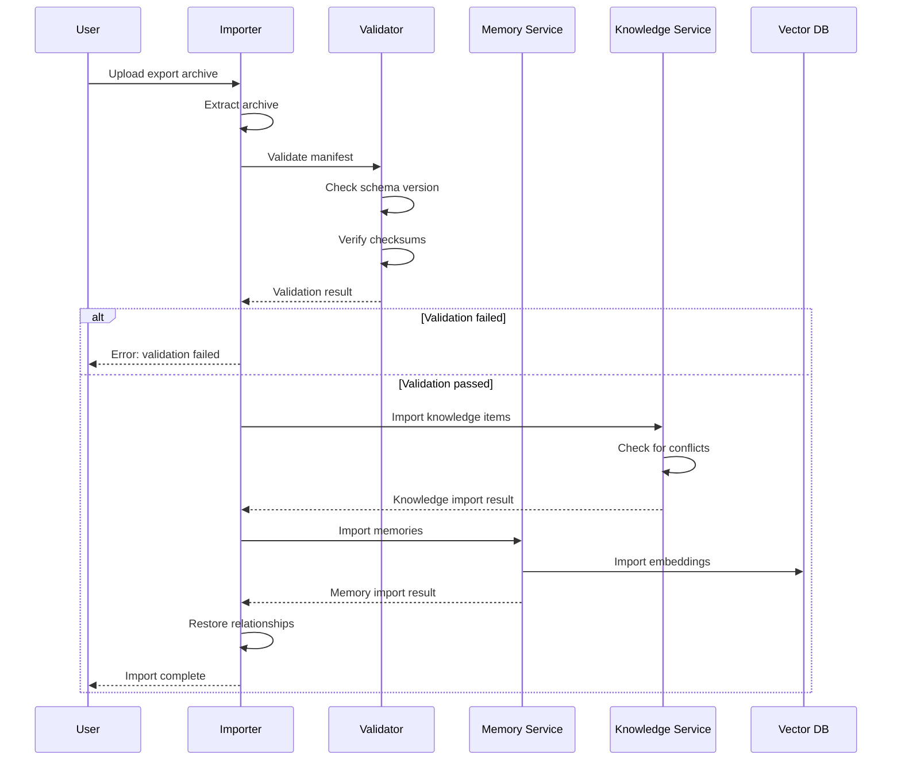
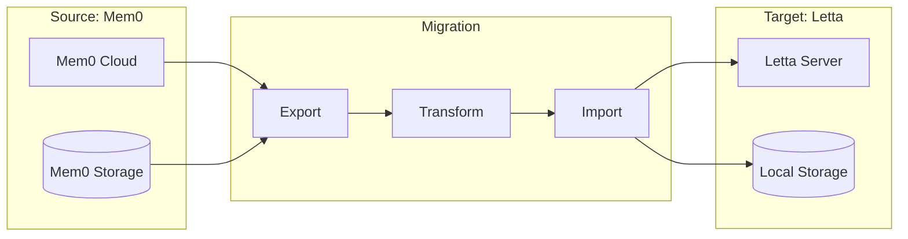

# 09 - Migration & Data Portability

```yaml
status: draft
version: 0.1.0
date: 2026-01-07
depends_on:
  - 02-memory-system.md
  - 03-knowledge-repository.md
  - 05-adapter-architecture.md
```

## Overview

This specification defines data portability standards, migration procedures, and import/export formats for the Memory-Knowledge System. The goal is to ensure organizations can:

1. **Switch providers** without data loss
2. **Export** data for backup or compliance
3. **Import** from legacy systems
4. **Migrate** between deployment models

---

## Export Format Specification

### Archive Structure

All exports use a standardized archive format:

```
memory-knowledge-export-{timestamp}/
├── manifest.json           # Export metadata
├── memory/
│   ├── memories.jsonl      # Memory records (JSON Lines)
│   ├── embeddings.bin      # Binary embeddings (optional)
│   └── embeddings.meta.json # Embedding metadata
├── knowledge/
│   ├── items.jsonl         # Knowledge items
│   ├── history.jsonl       # Version history
│   └── constraints.jsonl   # Constraint definitions
├── relationships/
│   ├── memory-knowledge.jsonl  # Pointer mappings
│   └── hierarchy.jsonl     # Layer relationships
└── checksums.sha256        # Integrity verification
```

### Manifest Schema

```json
{
  "$schema": "https://memory-knowledge-spec.org/schemas/export-manifest-v1.json",
  "version": "1.0.0",
  "exportedAt": "2026-01-07T02:00:00Z",
  "exportedBy": "system",
  "source": {
    "provider": "mem0",
    "version": "0.1.0",
    "organizationId": "org_xxx"
  },
  "scope": {
    "layers": ["project", "team", "org"],
    "dateRange": {
      "from": "2025-01-01T00:00:00Z",
      "to": "2026-01-07T00:00:00Z"
    },
    "filters": {
      "agentIds": ["agent_1", "agent_2"],
      "userIds": ["user_*"],
      "types": ["adr", "policy", "pattern"]
    }
  },
  "statistics": {
    "memories": {
      "total": 15420,
      "byLayer": {
        "agent": 8500,
        "user": 4200,
        "session": 2720
      }
    },
    "knowledge": {
      "total": 342,
      "byType": {
        "adr": 45,
        "policy": 128,
        "pattern": 97,
        "spec": 72
      }
    },
    "relationships": {
      "pointers": 892,
      "promotions": 156
    }
  },
  "integrity": {
    "algorithm": "sha256",
    "checksumFile": "checksums.sha256"
  }
}
```

### Memory Export Format (JSONL)

```jsonl
{"id":"mem_abc123","agentId":"agent_1","userId":"user_1","sessionId":"ses_001","layer":"session","content":"User prefers TypeScript over JavaScript for new projects","metadata":{"category":"preferences","confidence":0.92},"embedding":{"model":"text-embedding-3-large","dimensions":3072,"vectorId":"vec_xyz"},"createdAt":"2026-01-05T10:30:00Z","updatedAt":"2026-01-05T10:30:00Z","sourceKnowledge":{"id":"adr-001-typescript-standard","contentHash":"abc123...","syncedAt":"2026-01-05T11:00:00Z"}}
{"id":"mem_abc124","agentId":"agent_1","userId":"user_2","sessionId":"ses_002","layer":"user","content":"Security team requires all API endpoints to use JWT authentication","metadata":{"category":"security","confidence":0.98},"embedding":{"model":"text-embedding-3-large","dimensions":3072,"vectorId":"vec_xyz2"},"createdAt":"2026-01-06T14:20:00Z","updatedAt":"2026-01-06T14:20:00Z","sourceKnowledge":null}
```

### Knowledge Export Format (JSONL)

```jsonl
{"id":"adr-001-typescript-standard","type":"adr","layer":"org","title":"Use TypeScript for All New Projects","summary":"Standardize on TypeScript for improved type safety and developer experience","content":"# ADR-001: TypeScript Standard\n\n## Status\nAccepted\n\n## Context\n...","contentHash":"sha256:abc123def456...","severity":"info","status":"accepted","tags":["typescript","standards","tooling"],"constraints":[{"operator":"must_use","target":"file","pattern":"*.ts","appliesTo":["src/**"],"severity":"warn","message":"Use TypeScript for source files"}],"metadata":{"author":"tech-lead","reviewers":["architect","security"]},"version":3,"createdAt":"2025-06-15T09:00:00Z","updatedAt":"2026-01-02T16:30:00Z","promotedAt":"2025-07-01T10:00:00Z","promotedFrom":"project"}
{"id":"policy-auth-jwt","type":"policy","layer":"company","title":"JWT Authentication Required","summary":"All API endpoints must use JWT for authentication","content":"# Policy: JWT Authentication\n\n## Scope\n...","contentHash":"sha256:def789ghi012...","severity":"block","status":"active","tags":["security","authentication","api"],"constraints":[{"operator":"must_match","target":"code","pattern":"@Authenticated|@JwtAuth|requireAuth","appliesTo":["**/controllers/**","**/routes/**"],"severity":"block","message":"API endpoints must have authentication"}],"metadata":{"complianceRef":"SOC2-AC-1"},"version":1,"createdAt":"2025-03-10T11:00:00Z","updatedAt":"2025-03-10T11:00:00Z","promotedAt":null,"promotedFrom":null}
```

### Embeddings Format

Binary format for efficient storage:

```typescript
// embeddings.meta.json
interface EmbeddingsMeta {
  model: string;
  dimensions: number;
  count: number;
  format: 'float32' | 'float16';
  byteOrder: 'little-endian' | 'big-endian';
  index: Array<{
    id: string;
    offset: number;  // Byte offset in .bin file
  }>;
}

// embeddings.bin: Raw float32 vectors concatenated
// Each vector: dimensions * 4 bytes (float32)
```

---

## Import Procedures

### Import Flow



### Import API

```typescript
interface ImportOptions {
  // Archive source
  source: string | ReadableStream;  // File path or stream
  
  // Conflict resolution
  conflictStrategy: 'skip' | 'overwrite' | 'rename' | 'merge';
  
  // Scope filtering
  filter?: {
    layers?: string[];
    types?: string[];
    dateRange?: { from: Date; to: Date };
  };
  
  // Mapping transformations
  transforms?: {
    agentIdMap?: Record<string, string>;
    userIdMap?: Record<string, string>;
    layerMap?: Record<string, string>;
  };
  
  // Options
  dryRun?: boolean;
  validateOnly?: boolean;
  embeddings?: 'import' | 'regenerate' | 'skip';
}

interface ImportResult {
  success: boolean;
  statistics: {
    memories: {
      imported: number;
      skipped: number;
      failed: number;
      conflicts: number;
    };
    knowledge: {
      imported: number;
      skipped: number;
      failed: number;
      conflicts: number;
    };
    relationships: {
      restored: number;
      broken: number;  // References to missing items
    };
  };
  errors: ImportError[];
  warnings: ImportWarning[];
  duration: number;
}
```

### Import CLI

```bash
# Basic import
mk-import ./export-2026-01-07.tar.gz

# Dry run to see what would happen
mk-import ./export.tar.gz --dry-run

# Import with conflict handling
mk-import ./export.tar.gz --conflict-strategy=merge

# Import only specific layers
mk-import ./export.tar.gz --filter-layers=project,team

# Import with ID remapping
mk-import ./export.tar.gz \
  --agent-id-map='{"old_agent":"new_agent"}' \
  --user-id-map='{"old_user":"new_user"}'

# Regenerate embeddings during import
mk-import ./export.tar.gz --embeddings=regenerate
```

---

## Provider Migration

### Mem0 to Letta Migration



#### Step 1: Export from Mem0

```python
# export_mem0.py
from mem0 import MemoryClient
import json

client = MemoryClient(api_key="your-api-key")

# Export all memories
memories = client.get_all(
    output_format="v1.1"  # Standard export format
)

# Write to JSONL
with open('memory/memories.jsonl', 'w') as f:
    for memory in memories:
        f.write(json.dumps(transform_mem0_to_standard(memory)) + '\n')

def transform_mem0_to_standard(mem0_memory):
    """Transform Mem0 format to standard export format."""
    return {
        "id": mem0_memory["id"],
        "agentId": mem0_memory.get("agent_id", "default"),
        "userId": mem0_memory.get("user_id"),
        "sessionId": mem0_memory.get("metadata", {}).get("session_id"),
        "layer": infer_layer(mem0_memory),
        "content": mem0_memory["memory"],  # Mem0 uses 'memory' field
        "metadata": mem0_memory.get("metadata", {}),
        "embedding": {
            "model": "text-embedding-3-small",
            "dimensions": 1536,
            "vectorId": mem0_memory.get("id")
        },
        "createdAt": mem0_memory["created_at"],
        "updatedAt": mem0_memory.get("updated_at", mem0_memory["created_at"]),
        "sourceKnowledge": None
    }
```

#### Step 2: Import to Letta

```python
# import_letta.py
from letta import create_client
import json

client = create_client()

# Create agent if needed
agent = client.create_agent(
    name="migrated-agent",
    memory_blocks=[
        {"label": "human", "value": ""},
        {"label": "persona", "value": ""}
    ]
)

# Import memories
with open('memory/memories.jsonl', 'r') as f:
    for line in f:
        memory = json.loads(line)
        
        # Letta uses archival memory for long-term storage
        client.insert_archival_memory(
            agent_id=agent.id,
            memory=transform_standard_to_letta(memory)
        )

def transform_standard_to_letta(standard_memory):
    """Transform standard format to Letta format."""
    return {
        "text": standard_memory["content"],
        "metadata": {
            **standard_memory["metadata"],
            "original_id": standard_memory["id"],
            "layer": standard_memory["layer"],
            "migrated_at": datetime.utcnow().isoformat()
        }
    }
```

### Letta to Mem0 Migration

```python
# export_letta.py
from letta import create_client
import json

client = create_client()

# Get all agents
agents = client.list_agents()

all_memories = []
for agent in agents:
    # Export archival memory
    archival = client.get_archival_memory(
        agent_id=agent.id,
        limit=10000
    )
    
    for memory in archival:
        all_memories.append(transform_letta_to_standard(memory, agent))

# Write export
with open('memory/memories.jsonl', 'w') as f:
    for memory in all_memories:
        f.write(json.dumps(memory) + '\n')
```

### OpenMemory Migration

For self-hosted OpenMemory instances:

```bash
# Export using OpenMemory CLI
openmemory export \
  --format=standard \
  --output=./export \
  --include-embeddings

# Import to new instance
openmemory import \
  --source=./export \
  --target-url=https://new-instance.example.com \
  --conflict-strategy=merge
```

---

## Legacy System Migration

### Custom Database Migration

For organizations with memories in custom databases:

```typescript
// migration-adapter.ts
interface LegacyMemory {
  // Define your legacy schema
  record_id: number;
  user_identifier: string;
  memory_text: string;
  category: string;
  created_date: Date;
}

interface MigrationAdapter {
  connect(): Promise<void>;
  fetchBatch(offset: number, limit: number): Promise<LegacyMemory[]>;
  getTotal(): Promise<number>;
  close(): Promise<void>;
}

// Example: PostgreSQL adapter
class PostgresLegacyAdapter implements MigrationAdapter {
  private pool: Pool;
  
  async connect() {
    this.pool = new Pool({
      connectionString: process.env.LEGACY_DB_URL
    });
  }
  
  async fetchBatch(offset: number, limit: number): Promise<LegacyMemory[]> {
    const result = await this.pool.query(
      `SELECT * FROM memories ORDER BY record_id LIMIT $1 OFFSET $2`,
      [limit, offset]
    );
    return result.rows;
  }
  
  async getTotal(): Promise<number> {
    const result = await this.pool.query('SELECT COUNT(*) FROM memories');
    return parseInt(result.rows[0].count);
  }
  
  async close() {
    await this.pool.end();
  }
}

// Migration runner
async function migrateLegacy(
  adapter: MigrationAdapter,
  transformer: (legacy: LegacyMemory) => StandardMemory,
  targetClient: MemoryKnowledgeClient
) {
  await adapter.connect();
  
  const total = await adapter.getTotal();
  const batchSize = 1000;
  let processed = 0;
  
  while (processed < total) {
    const batch = await adapter.fetchBatch(processed, batchSize);
    
    const standardMemories = batch.map(transformer);
    
    await targetClient.memory.bulkAdd(standardMemories);
    
    processed += batch.length;
    console.log(`Progress: ${processed}/${total} (${(processed/total*100).toFixed(1)}%)`);
  }
  
  await adapter.close();
}
```

### Elasticsearch Migration

```typescript
// elasticsearch-adapter.ts
import { Client } from '@elastic/elasticsearch';

class ElasticsearchLegacyAdapter implements MigrationAdapter {
  private client: Client;
  private scrollId: string | null = null;
  
  async connect() {
    this.client = new Client({
      node: process.env.ELASTICSEARCH_URL
    });
  }
  
  async fetchBatch(offset: number, limit: number) {
    if (offset === 0) {
      // Initial query
      const response = await this.client.search({
        index: 'memories',
        scroll: '5m',
        size: limit,
        body: {
          query: { match_all: {} },
          sort: [{ created_at: 'asc' }]
        }
      });
      this.scrollId = response._scroll_id;
      return response.hits.hits.map(h => h._source);
    } else {
      // Scroll query
      const response = await this.client.scroll({
        scroll_id: this.scrollId!,
        scroll: '5m'
      });
      this.scrollId = response._scroll_id;
      return response.hits.hits.map(h => h._source);
    }
  }
  
  async getTotal() {
    const response = await this.client.count({ index: 'memories' });
    return response.count;
  }
  
  async close() {
    if (this.scrollId) {
      await this.client.clearScroll({ scroll_id: this.scrollId });
    }
    await this.client.close();
  }
}
```

### MongoDB Migration

```typescript
// mongodb-adapter.ts
import { MongoClient, Db } from 'mongodb';

class MongoLegacyAdapter implements MigrationAdapter {
  private client: MongoClient;
  private db: Db;
  
  async connect() {
    this.client = new MongoClient(process.env.MONGODB_URL!);
    await this.client.connect();
    this.db = this.client.db('legacy');
  }
  
  async fetchBatch(offset: number, limit: number) {
    return this.db.collection('memories')
      .find({})
      .sort({ _id: 1 })
      .skip(offset)
      .limit(limit)
      .toArray();
  }
  
  async getTotal() {
    return this.db.collection('memories').countDocuments();
  }
  
  async close() {
    await this.client.close();
  }
}
```

---

## Data Validation

### Validation Rules

```typescript
interface ValidationRule {
  field: string;
  check: (value: any) => boolean;
  severity: 'error' | 'warning';
  message: string;
}

const validationRules: ValidationRule[] = [
  // Required fields
  {
    field: 'id',
    check: (v) => typeof v === 'string' && v.length > 0,
    severity: 'error',
    message: 'ID is required and must be non-empty string'
  },
  {
    field: 'content',
    check: (v) => typeof v === 'string' && v.length > 0,
    severity: 'error',
    message: 'Content is required'
  },
  {
    field: 'layer',
    check: (v) => ['agent', 'user', 'session', 'project', 'team', 'org', 'company'].includes(v),
    severity: 'error',
    message: 'Layer must be valid hierarchy level'
  },
  
  // Format validation
  {
    field: 'createdAt',
    check: (v) => !isNaN(Date.parse(v)),
    severity: 'error',
    message: 'createdAt must be valid ISO 8601 date'
  },
  
  // Warnings
  {
    field: 'embedding',
    check: (v) => v !== null && v.dimensions > 0,
    severity: 'warning',
    message: 'Missing embedding will require regeneration'
  },
  {
    field: 'metadata',
    check: (v) => typeof v === 'object',
    severity: 'warning',
    message: 'Metadata should be an object'
  }
];

async function validateExport(exportPath: string): Promise<ValidationResult> {
  const errors: ValidationError[] = [];
  const warnings: ValidationWarning[] = [];
  
  // Validate manifest
  const manifest = await readJson(`${exportPath}/manifest.json`);
  if (!isValidManifest(manifest)) {
    errors.push({ type: 'manifest', message: 'Invalid manifest schema' });
  }
  
  // Validate checksums
  const checksumValid = await verifyChecksums(`${exportPath}/checksums.sha256`);
  if (!checksumValid) {
    errors.push({ type: 'integrity', message: 'Checksum verification failed' });
  }
  
  // Validate memories
  const memoriesFile = `${exportPath}/memory/memories.jsonl`;
  let lineNum = 0;
  for await (const line of readLines(memoriesFile)) {
    lineNum++;
    const memory = JSON.parse(line);
    
    for (const rule of validationRules) {
      if (!rule.check(memory[rule.field])) {
        const item = { line: lineNum, field: rule.field, message: rule.message };
        if (rule.severity === 'error') {
          errors.push(item);
        } else {
          warnings.push(item);
        }
      }
    }
  }
  
  return {
    valid: errors.length === 0,
    errors,
    warnings
  };
}
```

### Integrity Verification

```bash
# checksums.sha256 format
sha256sum memory/memories.jsonl
sha256sum memory/embeddings.bin
sha256sum knowledge/items.jsonl
sha256sum knowledge/history.jsonl

# Verification script
#!/bin/bash
set -e

cd "$EXPORT_DIR"

echo "Verifying checksums..."
sha256sum -c checksums.sha256

echo "Validating JSON..."
for f in memory/*.jsonl knowledge/*.jsonl; do
  echo "Checking $f..."
  while IFS= read -r line; do
    echo "$line" | jq -e . > /dev/null || {
      echo "Invalid JSON in $f"
      exit 1
    }
  done < "$f"
done

echo "All validations passed"
```

---

## Rollback Procedures

### Pre-Migration Backup

```bash
#!/bin/bash
# pre-migration-backup.sh

BACKUP_DIR="/backups/pre-migration-$(date +%Y%m%d-%H%M%S)"
mkdir -p "$BACKUP_DIR"

echo "Creating pre-migration backup..."

# Backup PostgreSQL
pg_dump -h "$DB_HOST" -U "$DB_USER" memory > "$BACKUP_DIR/memory.sql"
pg_dump -h "$DB_HOST" -U "$DB_USER" knowledge > "$BACKUP_DIR/knowledge.sql"

# Backup Qdrant
curl -X POST "http://$QDRANT_HOST:6333/collections/memories/snapshots" \
  -o "$BACKUP_DIR/qdrant-memories.snapshot"
curl -X POST "http://$QDRANT_HOST:6333/collections/knowledge/snapshots" \
  -o "$BACKUP_DIR/qdrant-knowledge.snapshot"

# Create manifest
cat > "$BACKUP_DIR/manifest.json" <<EOF
{
  "created": "$(date -u +%Y-%m-%dT%H:%M:%SZ)",
  "reason": "pre-migration",
  "components": ["postgresql", "qdrant"]
}
EOF

echo "Backup complete: $BACKUP_DIR"
```

### Rollback Script

```bash
#!/bin/bash
# rollback.sh

BACKUP_DIR=$1

if [ -z "$BACKUP_DIR" ]; then
  echo "Usage: rollback.sh <backup-dir>"
  exit 1
fi

echo "WARNING: This will restore from $BACKUP_DIR"
echo "All current data will be LOST."
read -p "Continue? (yes/no) " confirm

if [ "$confirm" != "yes" ]; then
  echo "Rollback cancelled"
  exit 0
fi

echo "Stopping services..."
docker-compose stop memory-service knowledge-service sync-service

echo "Restoring PostgreSQL..."
psql -h "$DB_HOST" -U "$DB_USER" -c "DROP DATABASE IF EXISTS memory"
psql -h "$DB_HOST" -U "$DB_USER" -c "CREATE DATABASE memory"
psql -h "$DB_HOST" -U "$DB_USER" memory < "$BACKUP_DIR/memory.sql"

psql -h "$DB_HOST" -U "$DB_USER" -c "DROP DATABASE IF EXISTS knowledge"
psql -h "$DB_HOST" -U "$DB_USER" -c "CREATE DATABASE knowledge"
psql -h "$DB_HOST" -U "$DB_USER" knowledge < "$BACKUP_DIR/knowledge.sql"

echo "Restoring Qdrant..."
curl -X DELETE "http://$QDRANT_HOST:6333/collections/memories"
curl -X DELETE "http://$QDRANT_HOST:6333/collections/knowledge"

curl -X PUT "http://$QDRANT_HOST:6333/collections/memories/snapshots/recover" \
  -H "Content-Type: application/json" \
  -d "{\"location\": \"$BACKUP_DIR/qdrant-memories.snapshot\"}"
curl -X PUT "http://$QDRANT_HOST:6333/collections/knowledge/snapshots/recover" \
  -H "Content-Type: application/json" \
  -d "{\"location\": \"$BACKUP_DIR/qdrant-knowledge.snapshot\"}"

echo "Starting services..."
docker-compose up -d memory-service knowledge-service sync-service

echo "Rollback complete"
```

### Point-in-Time Recovery

```typescript
interface PITROptions {
  targetTime: Date;
  targetConsistency: 'strict' | 'relaxed';
}

async function pointInTimeRecovery(options: PITROptions): Promise<RecoveryResult> {
  const { targetTime, targetConsistency } = options;
  
  // Find closest backup before target time
  const backups = await listBackups();
  const baseBackup = backups
    .filter(b => b.timestamp < targetTime)
    .sort((a, b) => b.timestamp.getTime() - a.timestamp.getTime())[0];
  
  if (!baseBackup) {
    throw new Error('No backup found before target time');
  }
  
  // Restore base backup
  await restoreBackup(baseBackup.path);
  
  // Replay WAL to target time (PostgreSQL)
  if (targetConsistency === 'strict') {
    await replayWAL(baseBackup.timestamp, targetTime);
  }
  
  // Rebuild vector indexes
  await rebuildVectorIndexes();
  
  return {
    restoredFrom: baseBackup.timestamp,
    restoredTo: targetTime,
    consistency: targetConsistency
  };
}
```

---

## Migration Checklist

### Pre-Migration

- [ ] Create full backup of source system
- [ ] Verify backup integrity
- [ ] Test restore procedure in staging
- [ ] Document current data statistics
- [ ] Plan maintenance window
- [ ] Notify stakeholders

### During Migration

- [ ] Stop source system writes (if possible)
- [ ] Run export
- [ ] Validate export integrity
- [ ] Run import with `--dry-run`
- [ ] Review dry-run results
- [ ] Run actual import
- [ ] Verify data counts match

### Post-Migration

- [ ] Run validation queries
- [ ] Test sample queries
- [ ] Verify relationship integrity
- [ ] Run application smoke tests
- [ ] Monitor error rates
- [ ] Keep backup for 30 days

### Rollback Criteria

Trigger rollback if:
- Data count mismatch > 1%
- Query latency increased > 50%
- Error rate increased > 5%
- Critical functionality broken

---

## Troubleshooting

### Common Issues

| Issue | Cause | Solution |
|-------|-------|----------|
| Checksum mismatch | Corrupted download | Re-download archive |
| ID conflicts | Duplicate IDs | Use `--conflict-strategy=rename` |
| Missing embeddings | Different model | Use `--embeddings=regenerate` |
| UTF-8 errors | Encoding mismatch | Convert source to UTF-8 |
| Memory limit | Large batch | Reduce batch size |
| Slow import | Missing indexes | Create indexes before import |

### Debug Mode

```bash
# Enable verbose logging
export MK_LOG_LEVEL=debug

# Import with detailed logging
mk-import ./export.tar.gz --verbose --log-file=migration.log

# Check specific record
mk-import --validate-record='{"id":"mem_abc123",...}'
```

---

## Related Specifications

- [02-memory-system.md](./02-memory-system.md) - Memory schema
- [03-knowledge-repository.md](./03-knowledge-repository.md) - Knowledge schema
- [05-adapter-architecture.md](./05-adapter-architecture.md) - Provider interfaces
- [08-deployment.md](./08-deployment.md) - Deployment patterns
