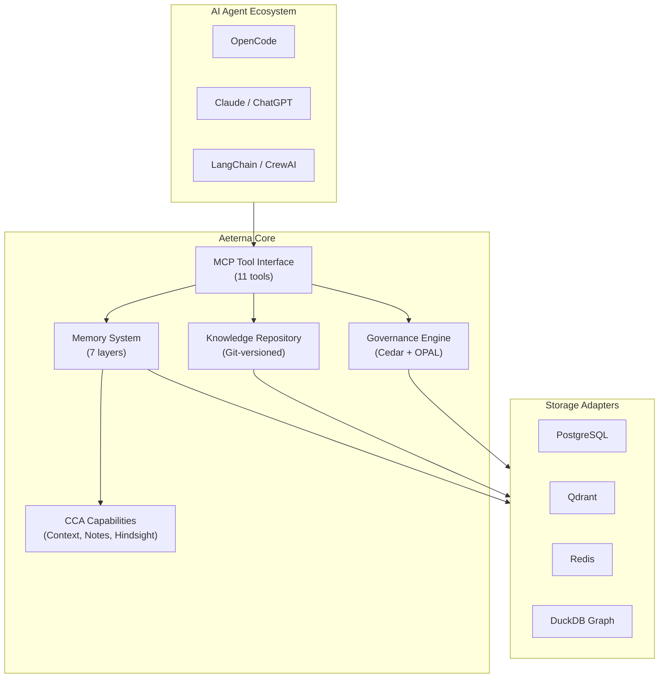

# Introduction to Aeterna

Aeterna is a **Universal Memory & Knowledge Framework** for enterprise AI agent systems. It provides persistent, hierarchical memory and governed organizational knowledge for AI agents at scale.

Built for companies deploying AI coding assistants, autonomous agents, and intelligent automation across hundreds of engineers and thousands of projects.

## Why Aeterna?

AI agents are stateless by default. Every session starts from zero. Organizational knowledge lives scattered across wikis, docs, and Slack. Teams stepping on each other. No audit trail. No policy enforcement.

Aeterna solves this:

| Challenge | Aeterna Solution |
|-----------|-----------------|
| Context window limits | Semantic memory with intelligent retrieval |
| Knowledge fragmentation | Git-versioned knowledge repository |
| No memory hierarchy | 7-layer memory with precedence rules |
| Vendor lock-in | Provider-agnostic adapter architecture |
| Multi-tenant chaos | Hierarchical isolation with policy inheritance |
| Compliance gaps | Cedar/OPAL authorization + policy engine |

## Architecture at a Glance



## Core Capabilities

### 7-Layer Memory Hierarchy

Memory is organized in layers with automatic precedence resolution:

```
Company  ← Global policies, standards (least specific)
  └─ Organization  ← Department rules, compliance
       └─ Team  ← Team conventions, patterns
            └─ Project  ← Project-specific context
                 └─ Session  ← Current conversation
                      └─ User  ← Personal preferences
                           └─ Agent  ← Agent-specific learnings (most specific)
```

### Knowledge Repository

Git-versioned knowledge base supporting:
- **ADRs** — Architecture Decision Records
- **Policies** — Enforceable constraints with severity levels
- **Patterns** — Reusable solutions (Strangler Fig, Anti-Corruption Layer)
- **Constraint DSL** — Declarative rules that guide agent behavior

### Enterprise Governance

- **Cedar policies** for fine-grained authorization
- **OPAL** for real-time policy synchronization
- **7 RBAC roles**: PlatformAdmin, TenantAdmin, Admin, Architect, Tech Lead, Developer, Agent
- **Drift detection** and policy inheritance across the hierarchy
- **Tenant config ownership boundaries** between platform-owned and tenant-owned fields and secret references

### MCP Tool Interface

11 unified tools exposed via Model Context Protocol:

| Category | Tools |
|----------|-------|
| Memory | `memory_add`, `memory_search`, `memory_delete`, `memory_feedback`, `memory_optimize` |
| Knowledge | `knowledge_query`, `knowledge_check`, `knowledge_show` |
| Graph | `graph_query`, `graph_neighbors`, `graph_path` |

## Deployment Modes

| Mode | Description | Best For |
|------|-------------|----------|
| **Local** | Everything runs on your machine | Development, single-user |
| **Hybrid** | Local agent + remote Aeterna server | Team development |
| **Remote** | Full Kubernetes deployment | Production, enterprise |

## Quick Links

- **Getting Started**: [Local Mode](./helm/quickstart-local) · [Hybrid Mode](./helm/quickstart-hybrid) · [Remote Mode](./helm/quickstart-remote)
- **Concepts**: [Architecture Overview](./architecture-overview) · [Core Concepts](./specs/core-concepts) · [Sequence Diagrams](./sequence-diagrams)
- **Integrations**: [MCP Server](./integrations/mcp-server) · [OpenCode Plugin](./integrations/opencode-integration)
- **Operations**: [CLI Reference](./guides/cli-quick-reference) · [Helm Chart](./helm/architecture) · [Production Checklist](./helm/production-checklist)
- **Governance**: [Policy Model](./governance/policy-model) · [RBAC Matrix](./security/rbac-matrix) · [Deployment Guide](./governance/deployment-guide) · [Tenant Admin Control Plane](./guides/tenant-admin-control-plane)

## Tech Stack

- **Language**: Rust (Edition 2024) with Axum HTTP
- **Database**: PostgreSQL 16+ (stock; no extensions required)
- **Vector Store**: Qdrant, Pinecone, Weaviate, MongoDB, Vertex AI, Databricks
- **Graph**: DuckDB
- **Authorization**: Cedar + OPAL
- **Cache**: Redis / Dragonfly
- **Deployment**: Helm chart for Kubernetes
- **Protocol**: MCP (Model Context Protocol), A2A (Agent-to-Agent)
