# Aeterna: Complete Sequence Diagrams

**Detailed Flow Diagrams for All Key Interactions**

---

## Table of Contents

1. [Memory Operations](#memory-operations)
2. [Knowledge Repository Operations](#knowledge-repository-operations)
3. [Sync Bridge Operations](#sync-bridge-operations)
4. [Governance & Policy Enforcement](#governance--policy-enforcement)
5. [Agent-to-Agent (A2A) Communication](#agent-to-agent-a2a-communication)
6. [Advanced Features (CCA)](#advanced-features-cca)
7. [Multi-Tenant Operations](#multi-tenant-operations)
8. [Error Handling & Recovery](#error-handling--recovery)

---

## Memory Operations

### 1.1 Memory Add with Embedding Generation


---

### 1.2 Multi-Layer Memory Search


---

### 1.3 Memory Promotion (Working → Team)


---

## Knowledge Repository Operations

### 2.1 Knowledge Query with Policy Check


---

### 2.2 Policy Addition with Approval Workflow

```mermaid
sequenceDiagram
    participant Sam as Sam (Architect)
    participant CLI as Aeterna CLI
    participant API as Aeterna API
    participant KnowledgeRepo as Knowledge Repository
    participant GitBackend as Git Backend
    participant Governance as Governance Engine
    participant Validator as Policy Validator
    participant Approver as Approval Service
    participant Notifier as Email/Slack Notifier

    Sam->>CLI: aeterna policy add --file policy.yaml
    activate CLI
    
    CLI->>Validator: validate_syntax(policy.yaml)
    activate Validator
    Validator->>Validator: Parse YAML
    Validator->>Validator: Check constraint syntax
    Validator->>Validator: Validate severity levels
    Validator-->>CLI: ✓ Valid
    deactivate Validator
    
    CLI->>API: POST /api/v1/knowledge/policy
    activate API
    
    API->>Governance: check_permission(sam, "policy:create")
    activate Governance
    Governance->>Governance: Query Cedar policy
    Governance-->>API: Allowed (role=architect)
    deactivate Governance
    
    API->>KnowledgeRepo: add_policy(policy_data)
    activate KnowledgeRepo
    
    KnowledgeRepo->>GitBackend: create_branch(feature/policy-xyz)
    activate GitBackend
    GitBackend->>GitBackend: git checkout -b
    GitBackend-->>KnowledgeRepo: ✓ Branch created
    deactivate GitBackend
    
    KnowledgeRepo->>GitBackend: commit_file(policies/new-policy.yaml)
    activate GitBackend
    GitBackend->>GitBackend: git add && git commit
    GitBackend-->>KnowledgeRepo: commit_sha
    deactivate GitBackend
    
    KnowledgeRepo->>Approver: create_approval_request()
    activate Approver
    Approver->>Approver: Determine required approvers
    Approver->>Approver: Create approval record
    Approver-->>KnowledgeRepo: approval_id
    deactivate Approver
    
    KnowledgeRepo->>Notifier: notify_approvers(approval_id)
    activate Notifier
    Notifier->>Notifier: Send emails to architects
    Notifier-->>KnowledgeRepo: ✓ Notified
    deactivate Notifier
    
    KnowledgeRepo-->>API: PolicyPending{id, approval_id}
    deactivate KnowledgeRepo
    
    API-->>CLI: 202 Accepted (pending approval)
    deactivate API
    
    CLI-->>Sam: ✓ Policy submitted, awaiting approval
    deactivate CLI
    
    Note over Sam,Notifier: Later: Approval Process
    
    participant Approver2 as Other Architect
    Approver2->>API: POST /api/v1/approvals/{id}/approve
    activate API
    
    API->>Approver: record_approval(user, approval_id)
    activate Approver
    Approver->>Approver: Check approval threshold met
    Approver-->>API: Status=approved
    deactivate Approver
    
    API->>GitBackend: merge_branch(feature/policy-xyz)
    activate GitBackend
    GitBackend->>GitBackend: git merge --ff
    GitBackend-->>API: ✓ Merged to main
    deactivate GitBackend
    
    API->>KnowledgeRepo: trigger_sync()
    activate KnowledgeRepo
    KnowledgeRepo->>KnowledgeRepo: Reindex policy
    KnowledgeRepo-->>API: ✓ Policy active
    deactivate KnowledgeRepo
    
    API-->>Approver2: 200 OK
    deactivate API
    
    API->>Notifier: notify_policy_active(sam)
    activate Notifier
    Notifier-->>Sam: 📧 Your policy is now active
    deactivate Notifier
```



---

## Sync Bridge Operations

### 3.1 Memory-to-Knowledge Sync (Bidirectional)


---

## Governance & Policy Enforcement

### 4.1 Real-Time Policy Validation


---

### 4.2 Drift Detection Workflow


---

## Agent-to-Agent (A2A) Communication

### 5.1 A2A Memory Sharing Protocol


---

### 5.2 Multi-Agent Collaboration Flow


---

## Advanced Features (CCA)

### 6.1 Context Architect: Hierarchical Compression


---

### 6.2 Hindsight Learning: Error Pattern Capture


---

## Multi-Tenant Operations

### 7.1 Tenant Isolation & RBAC


---

## Error Handling & Recovery

### 8.1 Graceful Degradation Flow

```mermaid
sequenceDiagram
    participant Agent as AI Agent
    participant API as Aeterna API
    participant MemManager as Memory Manager
    participant Qdrant as Qdrant (Primary)
    participant Postgres as PostgreSQL (Fallback)
    participant Redis as Redis (Cache)
    participant CircuitBreaker as Circuit Breaker
    participant Fallback as Fallback Logic
    participant Metrics as Metrics

    Agent->>API: POST /api/v1/memory/search
    activate API
    
    API->>MemManager: search(query, layers=[semantic])
    activate MemManager
    
    MemManager->>CircuitBreaker: check_state(qdrant)
    activate CircuitBreaker
    
    alt Circuit CLOSED (healthy)
        CircuitBreaker-->>MemManager: ✓ Proceed
        deactivate CircuitBreaker
        
        MemManager->>Qdrant: search_vectors(query)
        activate Qdrant
        
        alt Qdrant timeout
            Qdrant-->>MemManager: ❌ Timeout (5s)
            deactivate Qdrant
            
            MemManager->>CircuitBreaker: record_failure(qdrant)
            activate CircuitBreaker
            CircuitBreaker->>CircuitBreaker: Increment failure count: 3/5
            
            alt Failure threshold reached
                CircuitBreaker->>CircuitBreaker: Open circuit
                Note over CircuitBreaker: Circuit OPEN<br/>Fast-fail for 30s
            end
            
            CircuitBreaker-->>MemManager: Circuit state updated
            deactivate CircuitBreaker
            
            MemManager->>Metrics: increment(qdrant_failures)
            
            MemManager->>Fallback: execute_fallback(query)
            activate Fallback
            
            Fallback->>Redis: try_cache_lookup(query)
            activate Redis
            
            alt Cache hit
                Redis-->>Fallback: cached_results[5]
                deactivate Redis
                Fallback-->>MemManager: results (from cache)
            else Cache miss
                Redis-->>Fallback: Cache miss
                deactivate Redis
                
                Fallback->>Postgres: search_with_pgvector(query)
                activate Postgres
                Postgres-->>Fallback: results[8]
                deactivate Postgres
                
                Fallback->>Fallback: Mark as degraded quality
                Fallback-->>MemManager: results (degraded)
            end
            deactivate Fallback
            
            MemManager->>MemManager: Add degradation warning
            
        else Qdrant success
            Qdrant-->>MemManager: results[10]
            deactivate Qdrant
            
            MemManager->>CircuitBreaker: record_success(qdrant)
            activate CircuitBreaker
            CircuitBreaker->>CircuitBreaker: Reset failure count
            CircuitBreaker-->>MemManager: ✓
            deactivate CircuitBreaker
        end
        
    else Circuit OPEN (unhealthy)
        CircuitBreaker-->>MemManager: ❌ Circuit open, fast-fail
        deactivate CircuitBreaker
        
        Note over MemManager: Skip Qdrant, go directly to fallback
        
        MemManager->>Fallback: execute_fallback(query)
        activate Fallback
        Fallback->>Postgres: search_with_pgvector(query)
        activate Postgres
        Postgres-->>Fallback: results[8]
        deactivate Postgres
        Fallback-->>MemManager: results (degraded)
        deactivate Fallback
        
    else Circuit HALF_OPEN (testing)
        CircuitBreaker-->>MemManager: ⚠️ Test request
        deactivate CircuitBreaker
        
        MemManager->>Qdrant: search_vectors(query) [test]
        activate Qdrant
        
        alt Success
            Qdrant-->>MemManager: results[10]
            deactivate Qdrant
            
            MemManager->>CircuitBreaker: record_success(qdrant)
            activate CircuitBreaker
            CircuitBreaker->>CircuitBreaker: Close circuit (recovered)
            Note over CircuitBreaker: Circuit CLOSED<br/>Service recovered!
            CircuitBreaker-->>MemManager: ✓ Circuit closed
            deactivate CircuitBreaker
            
        else Failure
            Qdrant-->>MemManager: ❌ Still failing
            deactivate Qdrant
            
            MemManager->>CircuitBreaker: record_failure(qdrant)
            activate CircuitBreaker
            CircuitBreaker->>CircuitBreaker: Re-open circuit
            CircuitBreaker-->>MemManager: Circuit re-opened
            deactivate CircuitBreaker
            
            MemManager->>Fallback: execute_fallback(query)
            activate Fallback
            Fallback->>Postgres: search_with_pgvector(query)
            activate Postgres
            Postgres-->>Fallback: results[8]
            deactivate Postgres
            Fallback-->>MemManager: results (degraded)
            deactivate Fallback
        end
    end
    
    MemManager-->>API: SearchResults{results, quality_indicator}
    deactivate MemManager
    
    API-->>Agent: 200 OK (with degradation warning if applicable)
    deactivate API
    
    Note over Agent: Agent receives results<br/>even when Qdrant is down<br/>(Graceful degradation!)
```

---

## Summary

This document provides **complete sequence diagrams** for all major Aeterna workflows:

1. **Memory Operations** - Add, search, promote with detailed timing
2. **Knowledge Repository** - Query, policy management, approval workflows
3. **Sync Bridge** - Bidirectional synchronization with conflict resolution
4. **Governance** - Real-time validation, drift detection
5. **A2A Communication** - Agent-to-agent protocol with skill routing
6. **CCA Advanced** - Context compression, hindsight learning
7. **Multi-Tenant** - Isolation, RBAC, row-level security
8. **Error Handling** - Circuit breakers, fallback, graceful degradation

These diagrams demonstrate:
- **System resilience** - Fallbacks and graceful degradation
- **Security** - Multi-layer authorization and tenant isolation
- **Performance** - Caching, parallel processing, token optimization
- **Collaboration** - A2A protocol for multi-agent systems
- **Learning** - Error pattern capture and memory promotion

Each flow includes timing, error paths, and real-world scenarios.
